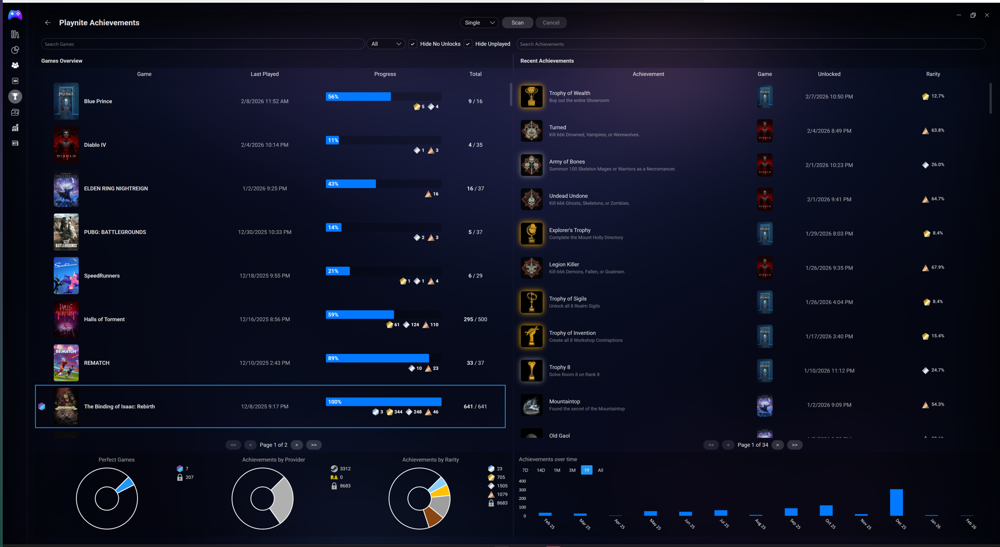
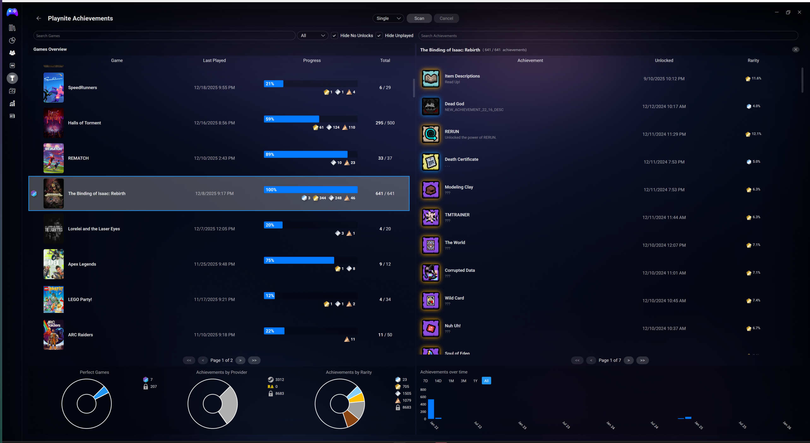
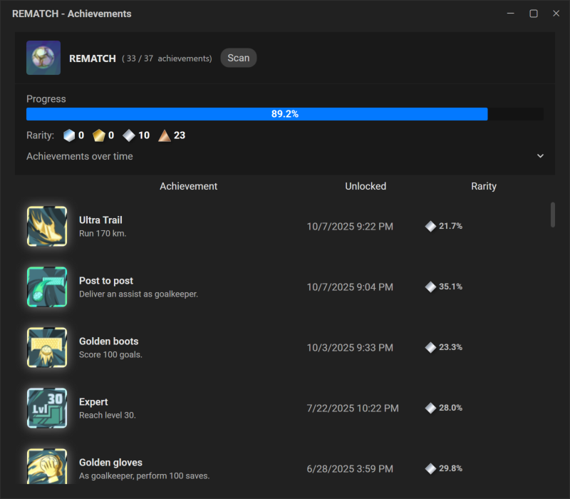
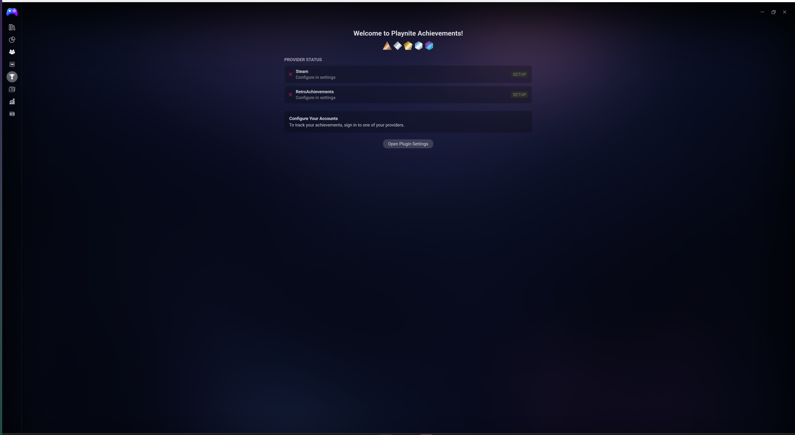
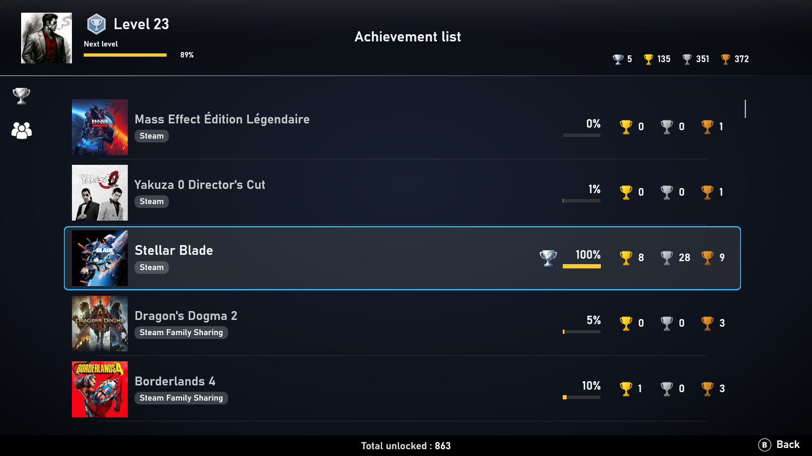
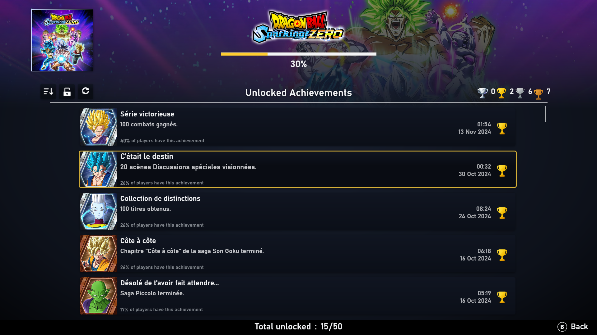
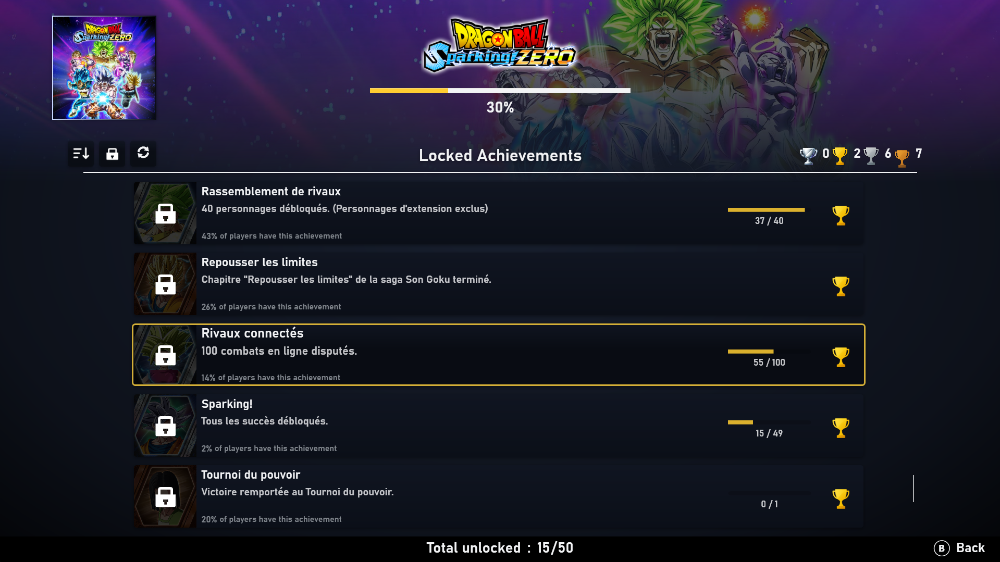

<p align="center">

</p>

<h1 align="center">Playnite Achievements</h1>

<div align="center">

[](https://github.com/justin-delano/PlayniteAchievements/releases/latest)
[](https://opensource.org/licenses/MIT)
[](https://playnite.link/)
[](https://github.com/justin-delano/PlayniteAchievements/releases)
[](https://github.com/justin-delano/PlayniteAchievements/releases/latest)

</div>

<p align="center">
A modern Playnite extension plugin for aggregating achievement data from multiple gaming platforms. Bring your gaming accomplishments together in one place with beautiful visualizations and seamless theme integration.
</p>

<p align="center">


</p>

## Why PlayniteAchievements?

| Traditional Approaches                | PlayniteAchievements                                                       |
| ------------------------------------- | -------------------------------------------------------------------------- |
| Limited platform support              | Modular architecture planning to support 10+ platforms                     |
| Existing theme ecosystem              | Automatic theme migration system, so your favorite themes can work with PA |
| Basic visualization tools             | Rich charts with rarity breakdowns and progress tracking                   |
| Single theme compatibility            | Dual integration: legacy and modern native controls                        |
| Fullscreen helper required            | Complete fullscreen integration included.                                  |
| Manual profile configuration required | Compatible with existing Steam privacy settings                            |

## Screenshots

### Sidebar View




### Single Game View



### Setup Page



### Theme Integration



## Features

### Multi-Platform Support

Track achievements across all your gaming platforms in one place.

**Currently Available**:

- Steam
- RetroAchievements

**Coming Soon**:

- GOG Galaxy, Epic Games Store, EA App
- Xbox (PC and Xbox 360 via Xenia)
- PlayStation Network (via RPCS3, ShadPS4 emulators)
- Battle.net, Exophase, GameJolt

### Beautiful Visualizations

See your progress at a glance with charts and statistics:

- Achievement progression timelines
- Rarity breakdowns (Common, Rare, UltraRare)
- Multiple view modes: compact lists, detailed grids, progress bars
- Custom icons for hidden achievements

### Seamless Theme Integration

Compatible with existing themes out of the box.

**Legacy Compatibility**: Drop-in replacement for SuccessStory themes. All familiar controls function without modification.

**Native Controls**: Modern themes utilize native PlayniteAchievements controls for improved performance and integration.

#### [Aniki-ReMake](https://github.com/Mike-Aniki/Aniki-ReMake/tree/main)




Additional theme support planned.

### Automatic Theme Migration

PlayniteAchievements includes an automatic theme migration tool that seamlessly updates your SuccessStory-based themes to work with PlayniteAchievements.

**How It Works:**

The migration tool automatically:

- Scans your Playnite themes directory for themes using SuccessStory
- Creates a selective backup of only files that contain SuccessStory references
- Updates all references from "SuccessStory" to "PlayniteAchievements"
- Preserves your theme's original structure and styling

**Features:**

- **Smart Detection**: Recursively scans theme files for SuccessStory references
- **Selective Backup**: Only backs up files that were actually modified, minimizing disk usage
- **Safe Revert**: Easily restore themes to their original state if needed
- **Skip Compatible**: Themes already using PlayniteAchievements are automatically skipped

**Accessing the Tool:**

1. **First-Time Prompt**: When you first install PlayniteAchievements, you'll see a landing page with the theme migration option
2. **Settings Page**: Access anytime via Settings → Extensions → PlayniteAchievements → Theme Migration tab

**What Gets Migrated:**

Only theme files containing SuccessStory references are modified.

Themes are searched in both Desktop and Fullscreen theme directories under your Playnite configuration folder.

### Fast & Reliable

- Intelligent caching maintains responsive performance
- Background updates operate without interrupting library browsing
- Graceful error handling continues scanning when individual games fail
- Configurable scan intervals for automatic updates

### Flexible Scanning

Choose how and when achievements are fetched:

- **Quick Scan**: Scans only recently played games for fast updates
- **Full Scan**: Refreshes achievement data for your entire library
- **Installed Games**: Limits scanning to games currently installed
- **Favorites**: Scans only your favorited titles
- **Selected**: Manually choose specific games to scan
- **Single Game**: View detailed achievement data for one game
- **Auto-Scan**: Automatically scans when new games are added to your library, or you finish a play session.

## Roadmap

**In Development**:

- GOG Galaxy provider
- Epic Games Store integration
- Additional native controls
- GamerScore compatibility

**Planned**:

- EA App, Xbox, PlayStation platforms
- Integration with [FriendsAchievementFeed](https://github.com/justin-delano/playnite-friendsachievementfeed-plugin)

Additional platforms and features are released as development completes.

## Installation

1. Download the latest `.pext` file from [Releases](https://github.com/justindelano/PlayniteAchievements/releases/latest)
2. Install via Playnite's addon browser or drag-drop into Playnite
3. Configure your platform credentials in Settings → Extensions → PlayniteAchievements

**Requirements**: Playnite 10+

## For Theme Developers

PlayniteAchievements provides comprehensive integration options for theme developers:

### Quick Start: Automatic Theme Migration

Theme developers can use the built-in theme migration tool to automatically update SuccessStory-based themes:

1. Install PlayniteAchievements
2. Open Settings → Extensions → PlayniteAchievements → Theme Migration
3. Select your theme from the dropdown
4. Click "Migrate" to automatically convert all SuccessStory references
5. Restart Playnite to apply changes

The tool creates a backup of modified files and can revert changes if needed. Fullscreen themes may have minor compatibility issues, which will be resolved in future updates, or as theme makers make adjustments.

### Manual Theme Integration

### SuccessStory Legacy Compatibility

Existing themes using SuccessStory controls work without modification. All familiar properties are supported:

| SuccessStory Property                                         | PlayniteAchievements Property                                         |
| ------------------------------------------------------------- | --------------------------------------------------------------------- |
| `{PluginSettings Plugin=SuccessStory, Path=HasData}`        | `{PluginSettings Plugin=PlayniteAchievements, Path=HasData}`        |
| `<ContentControl x:Name="SuccessStory_PluginCompactList"/>` | `<ContentControl x:Name="PlayniteAchievements_PluginCompactList"/>` |

Switching to Playnite Achievements is as easy as finding and replacing "SuccessStory" with "PlayniteAchievements" in your files.

### Native Controls (In Development)

Modern themes can use native PlayniteAchievements controls for better performance and additional features:

```xml
<Controls:AchievementList
    Achievements="{Binding GameAchievements}"
    HorizontalAlignment="Stretch"
    VerticalAlignment="Stretch" />
```

### Documentation

For detailed integration guides, property references, and code examples, a Theme Integration Wiki will be coming soon.

## Support & Contributing

- **Issues**: [GitHub Issue Tracker](https://github.com/justindelano/PlayniteAchievements/issues)
- **Discussions**: [GitHub Discussions](https://github.com/justindelano/PlayniteAchievements/discussions)
- **Translations**: Contributions welcome - submit a pull request with updated localization files

## License

MIT License - see [LICENSE](LICENSE) for details.

## Credits

Many thanks to everyone on the Playnite Discord for their expertise, feedback, and beta testing! Especially MikeAniki, Sky, Vivi, Jeshibu, HerrKnarz, savantcz, and Crow.
