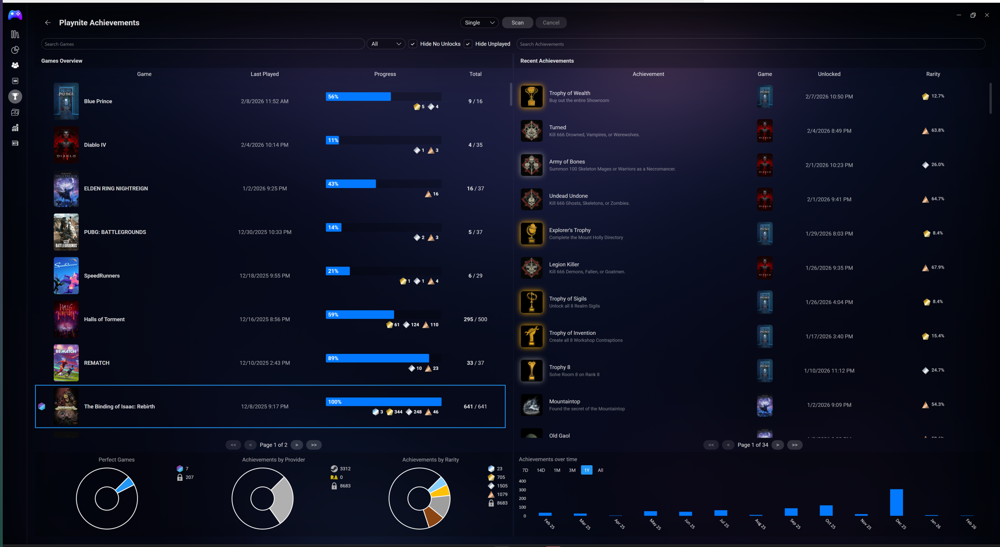
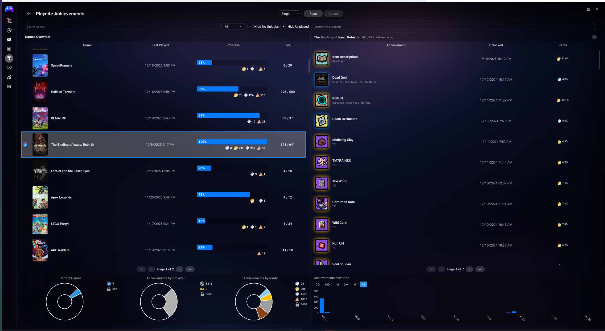
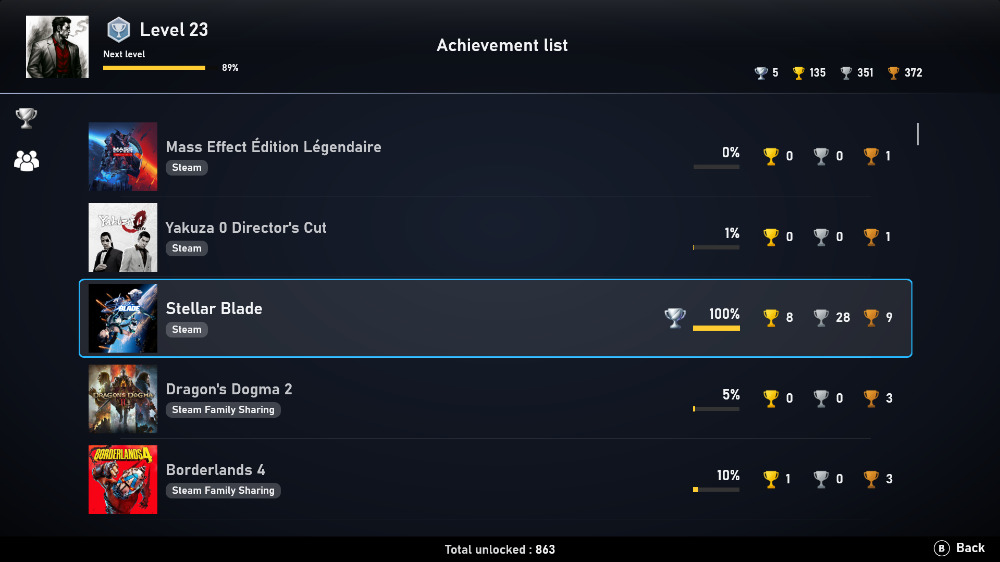
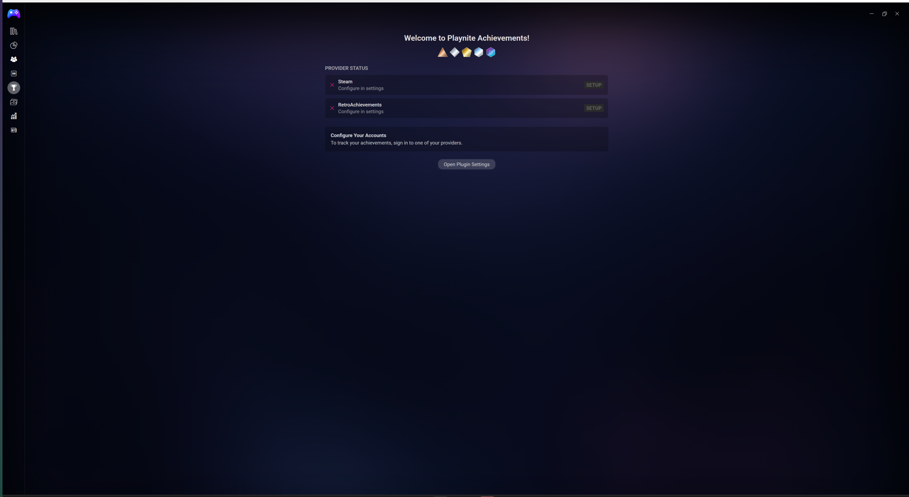

  

<h1 align="center">Playnite Achievements</h1>

Achievement tracking for Playnite across Steam, RetroAchievements, GOG, Epic, PSN, Xbox, RPCS3, ShadPS4, Xenia, and Exophase.

  

## Recent Updates

| Version | Highlights |
| --- | --- |
| 1.6.2 | Cache fixes, pie chart/display fixes, option to hide the top menu button |
| 1.6.1 | Exophase manual links, new category types, sidebar popout, display-settings cleanup |
| 1.6.0 | Game Options window, manual tracking, categories, custom order, summary exclusions, multi-select filters |

Docs: [Wiki Home](https://github.com/justin-delano/PlayniteAchievements/wiki) · [Release notes](InstallerManifest.yaml)

## Why Switch From Legacy

| Area | Legacy | PlayniteAchievements |
| --- | --- | --- |
| Theme integration | Legacy bindings | Legacy + modern bindings, Theme Migration, backup, revert |
| Views | Plugin window, one-game view | Sidebar, selected-game drilldown, top-panel popout |
| Charts and layout | Main plugin charts | Contextual pie charts, timeline, trophy charts, resizable/hideable grid columns |
| Refresh | Recent / installed / full style passes | Background refresh, single-game refresh, Custom Refresh, presets, include/exclude targeting |
| Per-game control | Separate fixes | One Game Options window: manual tracking, capstones, categories, order, exclusions, RA / Exophase overrides |
| Completion rules | Provider completion / 100% | Capstones, summary exclusions |
| Manual carryover | Rebuild manual links | Import legacy manual links from the Manual tab |
| Cleanup | Refresh/export tools | Cache clear, image-cache clear, CSV export, data/log folder access |

Docs: [Migration docs](https://github.com/justin-delano/PlayniteAchievements/wiki)

## Supported Platforms

| Type | Platforms |
| --- | --- |
| Store / service providers | Steam, GOG, Epic Games Store, PlayStation Network, Xbox Live, RetroAchievements |
| Emulator trophy providers | RPCS3, ShadPS4 |
| Extra tracking layers | Manual, Exophase |

Docs: [Provider setup in the wiki](https://github.com/justin-delano/PlayniteAchievements/wiki)

## What You Actually Get

| Area | What you can do |
| --- | --- |
| Sidebar | Drill into one game, filter by provider/completion/category/type, and use contextual pie charts plus timeline data |
| Refresh | Run quick refreshes or save a Custom Refresh preset with exact providers and game scope |
| Game Options | Fix one game's provider, add manual tracking, set capstones, categories, order, and exclusions |
| Library | Sync Playnite tags, set completion status, open a top-panel popout, clear cache, export CSV, and open logs |

Docs: [Settings and library tools](https://github.com/justin-delano/PlayniteAchievements/wiki)

## Views, Filters, and Refresh Workflows

- Sidebar filters by provider, completion state, game type, and category
- Pie charts change with the selected game where that context makes sense
- Refresh modes include recent, installed, favorites, full, single-game, and background updates
- Custom Refresh adds platform pickers, scope rules, include/exclude lists, overrides, and saved presets
- The top menu button can open the sidebar popout window

> Screenshot placeholder: [custom-refresh-dialog]

Docs: [Refresh workflows](https://github.com/justin-delano/PlayniteAchievements/wiki)

## Game Options and Per-Game Control

| Tab | What it does |
| --- | --- |
| Overview | Provider, source, last update, completion, cache actions |
| Manual Tracking | Link a source game, mark unlocks, store unlock times |
| Capstones | Pick the achievement that marks completion |
| Categories | Add type flags and category labels |
| Achievement Order | Set a custom drag-and-drop order |
| Overrides | Exclusions, summary exclusions, RetroAchievements override, Exophase override |

> Screenshot placeholder: [game-options-overview]
>
> Screenshot placeholder: [manual-tracking-tab]
>
> Screenshot placeholder: [categories-tab]
>
> Screenshot placeholder: [achievement-order-tab]

Docs: [Game Options in the wiki](https://github.com/justin-delano/PlayniteAchievements/wiki)

## Theme Integration and Migration

| Theme path | What you can do |
| --- | --- |
| Legacy themes | Keep using the legacy surface while switching plugins |
| Modern themes | Use modern Playnite Achievements controls and bindings |
| Migration modes | Limited, Full, or Custom |
| Safety | Backup before changes, revert after changes |

  

> Screenshot placeholder: [theme-migration-tab]

Docs: [Theme migration in the wiki](https://github.com/justin-delano/PlayniteAchievements/wiki)

## Installation and First-Time Setup

1. Download the latest `.pext` from [Releases](https://github.com/justin-delano/PlayniteAchievements/releases/latest).
2. Install it from Playnite's addon browser or drag the file into Playnite.
3. Open `Settings -> Extensions -> Playnite Achievements`.
4. Enable the providers you want and finish their setup.
5. Open the sidebar or top panel entry and run your first refresh.

If you are importing manual links from a legacy setup, do that first from the Manual tab. If you are moving a theme over, open Theme Migration before you start editing files by hand.

  

Docs: [First setup in the wiki](https://github.com/justin-delano/PlayniteAchievements/wiki)

## Docs

Full docs live in the wiki.

- [Open the wiki](https://github.com/justin-delano/PlayniteAchievements/wiki)

## Support / Contributing / Credits

- Issues: [GitHub Issue Tracker](https://github.com/justin-delano/PlayniteAchievements/issues)
- Discussions: [GitHub Discussions](https://github.com/justin-delano/PlayniteAchievements/discussions)
- Support: [Ko-fi](https://ko-fi.com/justindelano)
- Translations: contributions are welcome through pull requests and localization updates

Thanks to the Playnite Discord testers, theme authors, and everyone who kept reporting edge cases.

License: [MIT](LICENSE).

