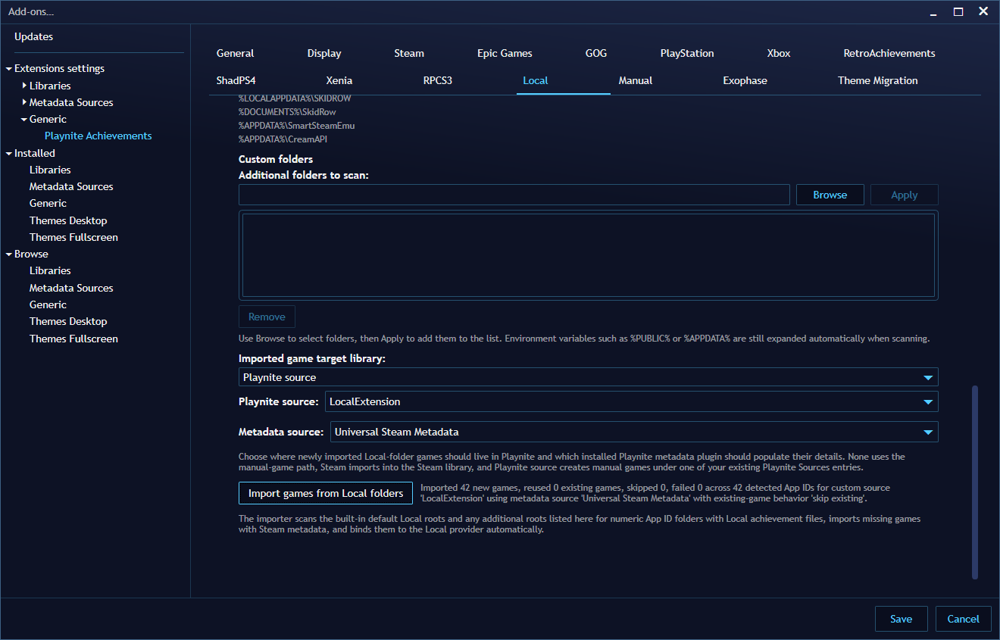

  

<h1 align="center">Playnite Achievements - Santodan Fork</h1>

> Official documentation for the base project should be taken from the original repository.
>
> - Original repository: https://github.com/justin-delano/PlayniteAchievements
> - Official wiki / documentation: https://github.com/justin-delano/PlayniteAchievements/wiki
> - Official releases: https://github.com/justin-delano/PlayniteAchievements/releases
> ## Quick Notes For Users Of This Fork
>
>- If you need setup instructions for Steam, GOG, Epic, RetroAchievements, PSN, Xbox, RPCS3, ShadPS4, Xenia, or Exophase, use the upstream wiki first.
>- If you are using this fork specifically for Local support, the main differences are the Local provider, Local overrides, Local compatibility fixes, and Local-focused refresh / notification work listed above.

## What This Fork Focuses On

- Local save support and local achievement
- No need for a steam account to gather the achivements schema
  - There is the option to select between Steam ( API ), SteamHunters and Completionist.me
- Compatibility work for non-standard Steam and local setups
  - If you are using Steam local saves ( GreenLuma or SteamTools, for example) the game will be detected as been from steam, you will need to override the provider to Local
- Per-game Local overrides inside Game Options
- Faster access to saved refresh presets from the main sidebar refresh selector
- Local-only realtime monitoring and notification improvements
- Add all the local achievements' games with the corresponding metadata

### Local Provider Folder List And Browse Flow

You can set any custom folder where you have saves located in your system

### Local Game Options Overrides

If you Right-click the game it will show a quicker way to do these changes:

From the PlayniteAchivements menu inside the game

### Local Realtime Monitoring And Sound Settings

This was a request from a user to have a sound playing when an achivement is unlocked while playing a game. 
Extra sounds in the [Resources/AdditionalSounds](source/Resources/AdditionalSounds)

.

### Local Achivements' Games import

This is a way of adding all of those achievements that are in the folders ina  way that it isn't needed to go through the foldrs and adding one by one

.

## Fork Changelog

The entries below are fork-side changes, grouped by date. When a date includes an upstream sync, only the fork-specific additions are called out here.

## 2026- - v2.1.1.4

- Corrected the compatability with Anaki themes
- Corrected the steam import without API key
- Added the possibility to import Steam family-shared games
- Added an icon for the local provider and a way of changing to your own icon
- Import achievements metadata even when there is no achievements file locally

### 2026-04-17 - v2.1.1.3

- Added anonymous Steam metadata lookup for the Local provider without requiring Steam API access, including selectable SteamHunters and Completionist.me source priority in Local settings.
- Changed the Steam-mode anonymous fallback flow to prefer SteamHunters first, with Steam Community kept only as a later title-based fallback and old Community-first configs remapped away from that path.
- Improved Local schema matching, hidden-achievement handling, and metadata enrichment for anonymous Steam sources so titles, descriptions, icons, and hidden flags resolve more reliably when public data is available.
- Fixed Local schema fallback order so progress-only Goldberg or GSE `achievements.json` files are no longer mistaken for full schema payloads.
- Removed the need for the steam account to have an API key
- Better refresh performance
- No longer needed the Steam API key for the extension to gather the owned games
- Added setting in the General tab to select the default filter in the main page
- Added the option to import all local games with achievements to the library and get the metadata ( Tested with Steam universal Metadata extension )
- Fixed theme migration

### 2026-04-15 - v2.1.1.2

- Updated the fork release metadata to `v2.1.1.2` so Playnite can notify users about new Santodan fork releases.
- Preserved the fork-specific addon identity so upstream releases no longer appear as direct Playnite extension updates for this fork.
- Fixed a merged dependency regression by restoring the working `protobuf-net 2.4.8` references used by the fork build.
- Fixed custom refresh UI freezes by moving expensive target-estimation work off the UI thread.

### 2026-04-15

- Synced the fork forward to the upstream `v2.1.0` codebase.
- Added near-real-time Local achievement monitoring for the currently running game only, instead of polling the whole library.
- Added Local unlock notifications with sound playback.
- Added bundled Local notification sounds plus a separate custom sound-path override.
- Added a Local test notification action so the configured notification + sound can be tested from settings.
- Set the Local default bundled sound flow to use a bundled fallback instead of requiring a custom path.
- Added quick access to saved custom refresh presets from the main sidebar refresh selector.
- Changed the sidebar refresh selector so presets are grouped under a `Presets` menu entry instead of being mixed into the top-level refresh list.
- Fixed Local-only preset targeting and estimation so Local presets only count games that the Local provider can actually resolve.
- Improved extra custom local-save-folder handling so it works as a list with browse support instead of a single raw path.

### 2026-04-11

- Fixed Local save handling for RUNE and OnlineFix layouts.

### 2026-04-08

- Changed Local behavior so cached Local achievement data is preserved when Steam API access is unavailable instead of trying to refetch everything and losing useful local-state visibility.

### 2026-04-07

- Added GreenLuma / SteamTool compatibility improvements.

### 2026-04-06

- Added per-game Local Steam App ID overrides in Game Options.
- Added per-game Local folder overrides in Game Options.

### 2026-04-01

- Added compatibility with the StartPage extension.
- Updated post-build handling to improve `Toolbox.exe` detection and execution.
- Synced the fork state around the upstream `v2.0.2` release.

### 2026-03-31

- Updated the fork for the upstream `2.0.0` / `2.0.1` transition.
- Renamed and reshaped the old cracked-save workflow into the Local provider flow.
- Added support for showing locked achievements even when `achievements.json` does not exist, as long as Local schema / cache data can still resolve them.
- Updated local extension naming and IDs for the fork.
- Replaced `CrackedSavesProvider` with `LocalSavesProvider`.

### 2026-03-29

- Added initial support for Local saves.
- Cleaned up leftover provider debug-path behavior during the early Local provider work.

## Upstream Docs And Credits

- Upstream project: https://github.com/justin-delano/PlayniteAchievements
- Upstream documentation: https://github.com/justin-delano/PlayniteAchievements/wiki
- Upstream releases: https://github.com/justin-delano/PlayniteAchievements/releases
- Santodan fork: https://github.com/Santodan/PlayniteAchievements

