

  <picture>
    <source
      media="(prefers-color-scheme: dark)"
      srcset="BrandingPackage/01-logo-dark-backgrounds/pa-stacked-master-crest-wordmark-spaced-gold.png"
    >
    <source
      media="(prefers-color-scheme: light)"
      srcset="BrandingPackage/02-logo-light-backgrounds/pa-stacked-master-crest-wordmark-spaced-blue.png"
    >
    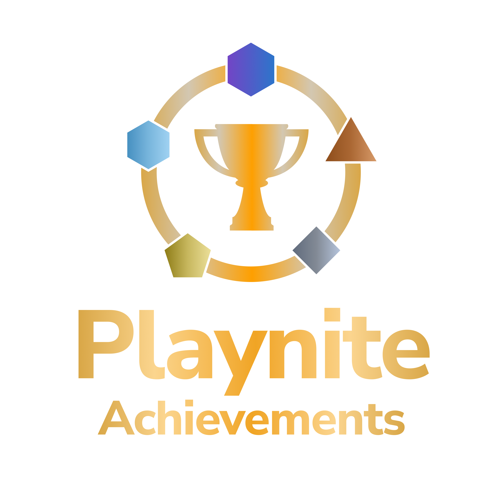
  </picture>

### Playnite Achievements is a modern, performant, and fully customizable achievement extension for Playnite. PlayniteAchievements tracks achievements from you and your friends and provides a deep set of features that allow you to tailor your achievement collection and display to your exact taste.

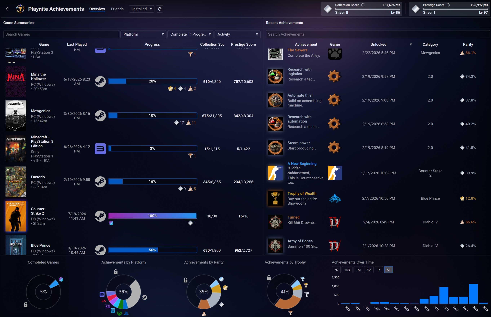

Playnite Achievements features include:

* PC storefronts, RetroAchievements & emulator support
  * [Steam](https://github.com/justin-delano/PlayniteAchievements/wiki/Steam), [GOG](https://github.com/justin-delano/PlayniteAchievements/wiki/GOG), [Epic Games Store](https://github.com/justin-delano/PlayniteAchievements/wiki/Epic), [Battle.net](https://github.com/justin-delano/PlayniteAchievements/wiki/BattleNet), [EA app](https://github.com/justin-delano/PlayniteAchievements/wiki/EA), [Game Jolt](https://github.com/justin-delano/PlayniteAchievements/wiki/GameJolt), [Riot Games](https://github.com/justin-delano/PlayniteAchievements/wiki/Riot)
  * [PlayStation Network](https://github.com/justin-delano/PlayniteAchievements/wiki/PSN), [Xbox Live](https://github.com/justin-delano/PlayniteAchievements/wiki/Xbox)
  * [RetroAchievements](https://github.com/justin-delano/PlayniteAchievements/wiki/RetroAchievements), [RPCS3](https://github.com/justin-delano/PlayniteAchievements/wiki/RPCS3), [ShadPS4](https://github.com/justin-delano/PlayniteAchievements/wiki/ShadPS4), [Xenia](https://github.com/justin-delano/PlayniteAchievements/wiki/Xenia)
  * [Final Fantasy XIV](https://github.com/justin-delano/PlayniteAchievements/wiki/Ffxiv)
  * [HoYoverse](https://github.com/justin-delano/PlayniteAchievements/wiki/Hoyoverse)
  * [Exophase](https://github.com/justin-delano/PlayniteAchievements/wiki/Exophase)
* [Manual achievement support](https://github.com/justin-delano/PlayniteAchievements/wiki/Manual-Tracking)
* [Friends achievement data](https://github.com/justin-delano/PlayniteAchievements/wiki/Friends)
* [Automatic syncing](https://github.com/justin-delano/PlayniteAchievements/wiki/Custom-Refresh)
* [Achievement unlock notifications](https://github.com/justin-delano/PlayniteAchievements/wiki/General) (with screenshots/recordings)
* [Achievement groups](https://github.com/justin-delano/PlayniteAchievements/wiki/Categories)
* [Custom achievement icons](https://github.com/justin-delano/PlayniteAchievements/wiki/Icons)
* [Theme Migration](https://github.com/justin-delano/PlayniteAchievements/wiki/Theme-Migration)
* [Hotkeys](https://github.com/justin-delano/PlayniteAchievements/wiki/General)
* [Tags](https://github.com/justin-delano/PlayniteAchievements/wiki/Tag-Sync)
* [Easy maintenance](https://github.com/justin-delano/PlayniteAchievements/wiki/General)

# Installation

Playnite Achievements is available in Playnite's add-on browser. Press F9 in Playnite, go to Browse > Generic Extensions, and search for "Playnite Achievements".

Alternatively, download the latest `.pext` from the [Releases page](https://github.com/justin-delano/PlayniteAchievements/releases/latest) and drag it onto the Playnite window to install it.

# First Time Setup

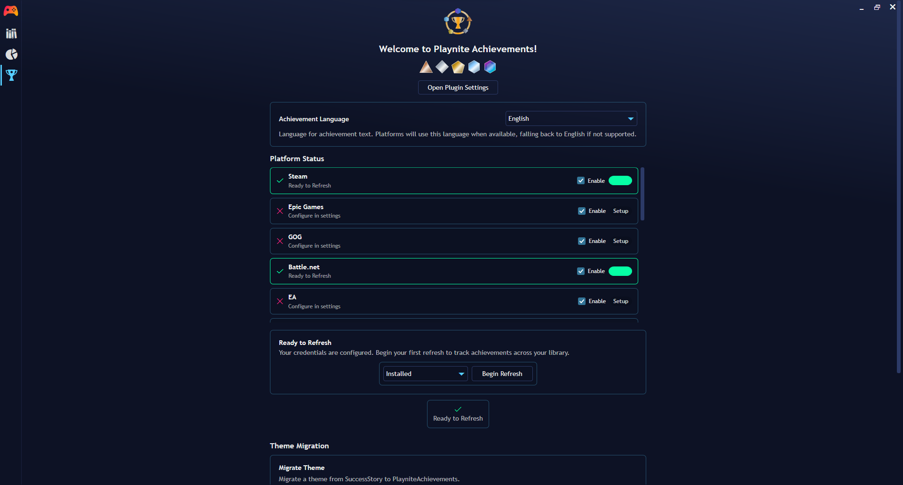

When you first start Playnite Achievements, you will be greeted by the landing page, with a list of achievement sources you can enable, and authenticate via the extension’s settings:

To authenticate with the various platforms PlayniteAchievements supports, navigate to the extension’s settings (or click the button on the landing page), and log into platforms using the Platforms tab.

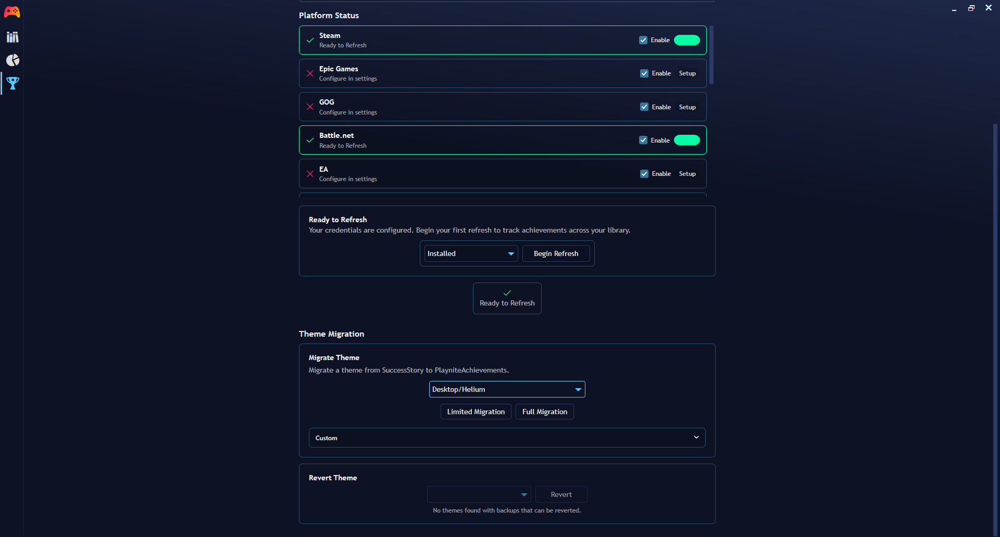

If your favorite Desktop theme was built to support SuccessStory, there is a useful [Theme Migration](https://github.com/justin-delano/PlayniteAchievements/wiki/Theme-Migration) function, which allows said theme to use PlayniteAchievements data instead. A limited migration will maintain full compatibility, while a full migration will enable new PlayniteAchievements specific features on all theme elements, such as new tooltip and click interactions for lists. A backup is made before all theme edits, and any theme migration can be reverted via a button in settings.

When you trigger a refresh, PlayniteAchievements will fetch metadata from your selected sources.

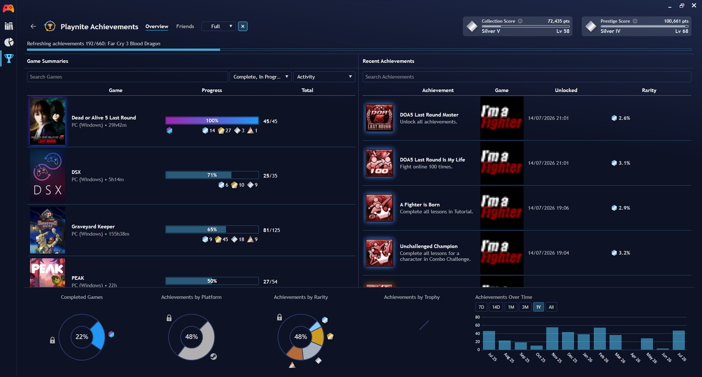

Refresh progress is shown at the top of the overview window. There are various types of refreshes, which can fetch data from installed games or recent games, or you can perform a Full refresh to fetch achievement data for all of your games.

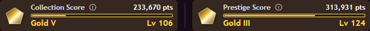

At the top right corner of the overview are your Score Cards. Your Collection Score increases as you collect achievements, with slight boosts for collecting rare achievements. Your Prestige Score increases as you unlock rare achievements, and common achievements are worth far less. Click the info button on either Score Card to learn more.

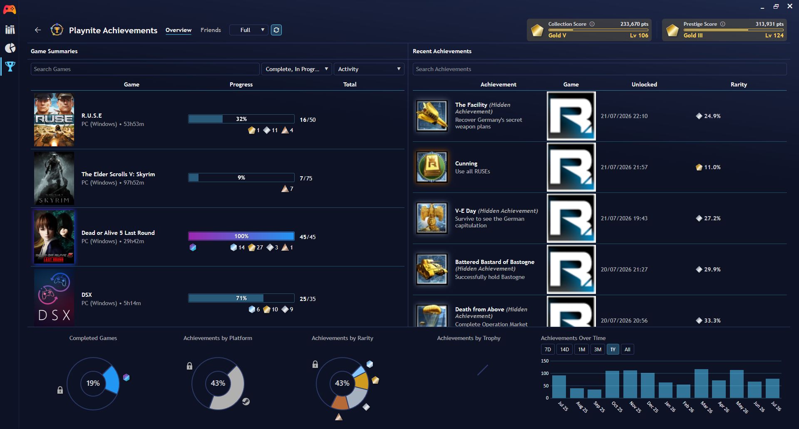

Congratulations! PlayniteAchievements is now fully functional. This concludes the first time setup guide, please see the other sections for a more detailed showcase of more advanced and enthusiast features.

See the [First Setup](https://github.com/justin-delano/PlayniteAchievements/wiki/First-Setup) guide and the [Settings](https://github.com/justin-delano/PlayniteAchievements/wiki/Settings) pages on the wiki for more detail.

# Friends

In addition to your own data, you can also retrieve achievement data for your friends. Steam, RetroAchievements, and Exophase are currently supported. First, navigate to the Friends tab in settings to get started:

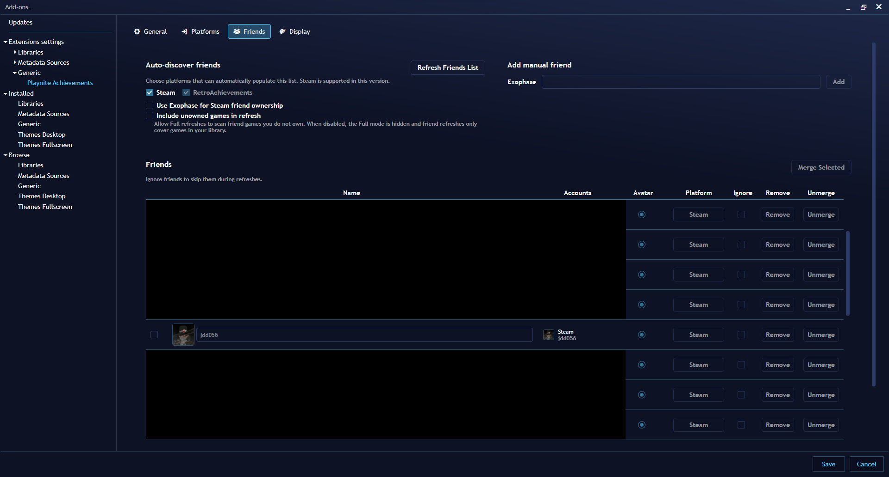

Friends data can be viewed and refreshed by selecting the Friends tab in the Overview window.

Note, with many friends and many games, these refreshes can take a significant amount of time! Shared/Recent refreshes will be the easiest to start with.

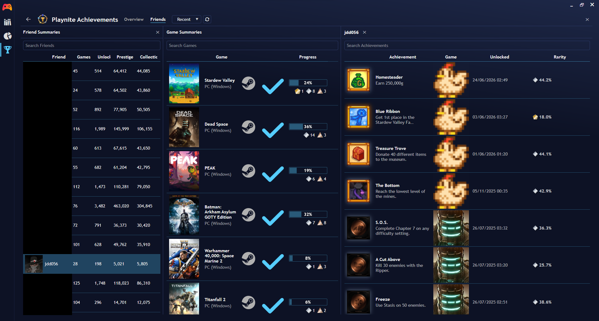

Every friends option is described on the [Friends](https://github.com/justin-delano/PlayniteAchievements/wiki/Friends) settings page on the wiki.

# Customization

PlayniteAchievements features comprehensive customization options.

  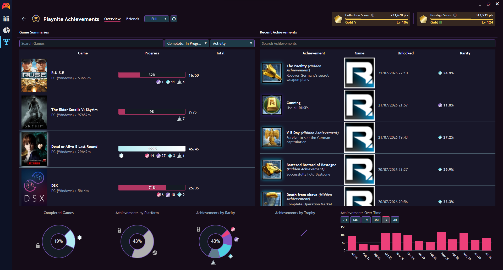
  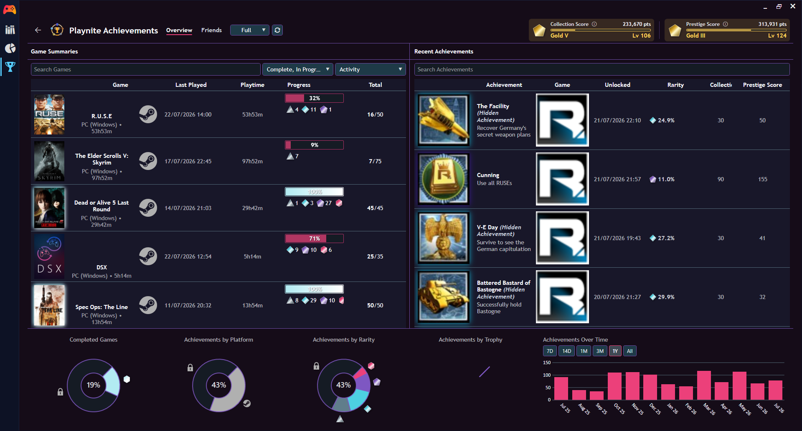

* Grid layout customizations
  * Column widths, column orders, column cell alignments
  * Separate per grid, for full flexibility
* Color and font customizations
  * All UI colors and fonts can be freely edited
  * 20 Presets for easy experimentation
  * Options to automatically follow Playnite theme colors.
* Rarity and completion accents
  * Add glowing borders to rare achievements or completed games.
  * Color text by achievement rarity
  * Show a special progress bar for completed games
* Flexible Overview visualizations
  * Pie charts for visualizing achievements per platform, rarity, or completion.
  * Bar chart for showing achievement progress over time.

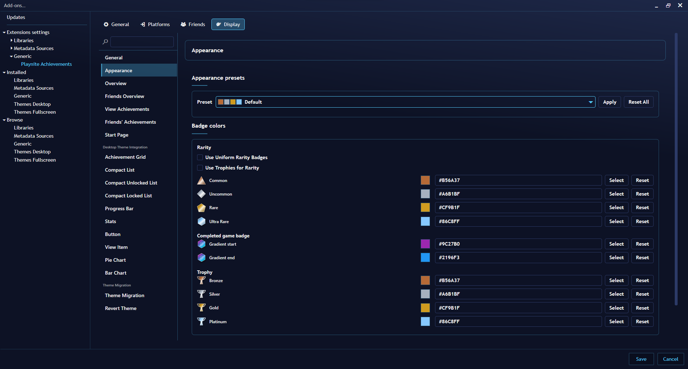

Every appearance option is described on the [Display](https://github.com/justin-delano/PlayniteAchievements/wiki/Display) settings page on the wiki.

# Per-Game Customization

The [Manage Achievements](https://github.com/justin-delano/PlayniteAchievements/wiki/Manage-Achievements) menu opens up another extremely powerful form of customization, with options available for each individual game in your library.

## Overview

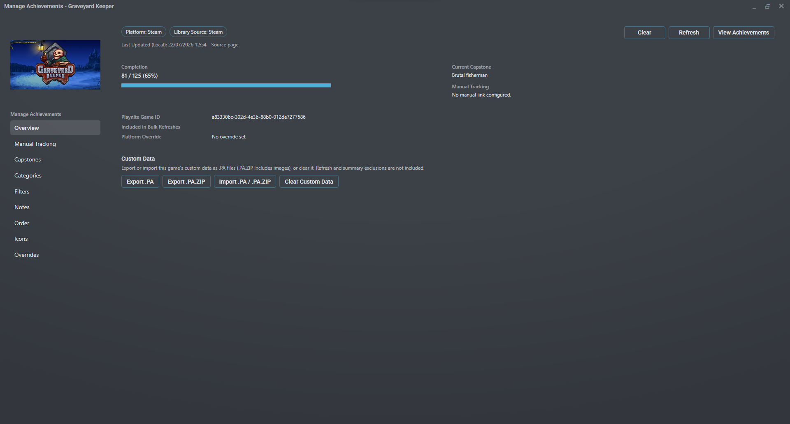

The overview tab allows you to see the general achievement status for the game. Additionally, you can export all per-game customized data to share with other users, or import their per-game customizations.

## Capstones

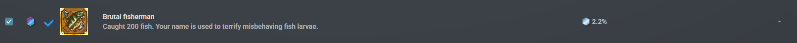

Some platforms automatically unlock an achievement to mark game completion, for example with PlayStation and Platinum trophies. To generalize this, PlayniteAchievements developed a Capstone system, which can be used by games on all platforms. Unlocking an achievement that has been marked as a capstone will mark the game as completed. This is particularly useful when DLC/Multiplayer trophies should not count towards game completion.

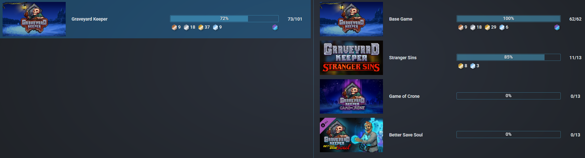

## Categories

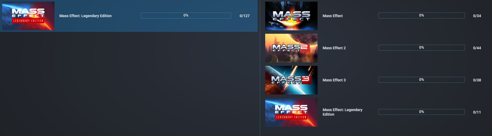

Achievements can be manually (or, in some cases, automatically) organized into categories. Each category can have a set of Types (Singleplayer, Stackable, Missable) as well as a Label ("DLC #1"). Categories are especially helpful for multi-game collections or games with many DLC packs.

## Filters

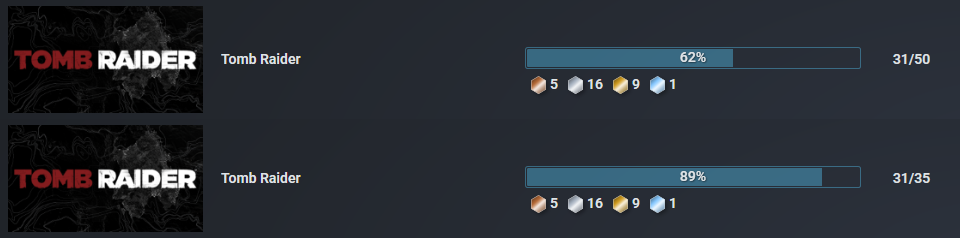

Filtered achievements are hidden from your views. This is particularly useful for games with unobtainable or multiplayer-specific achievements. For example, achievements could be filtered out of Tomb Raider’s list for these reasons.

## Notes

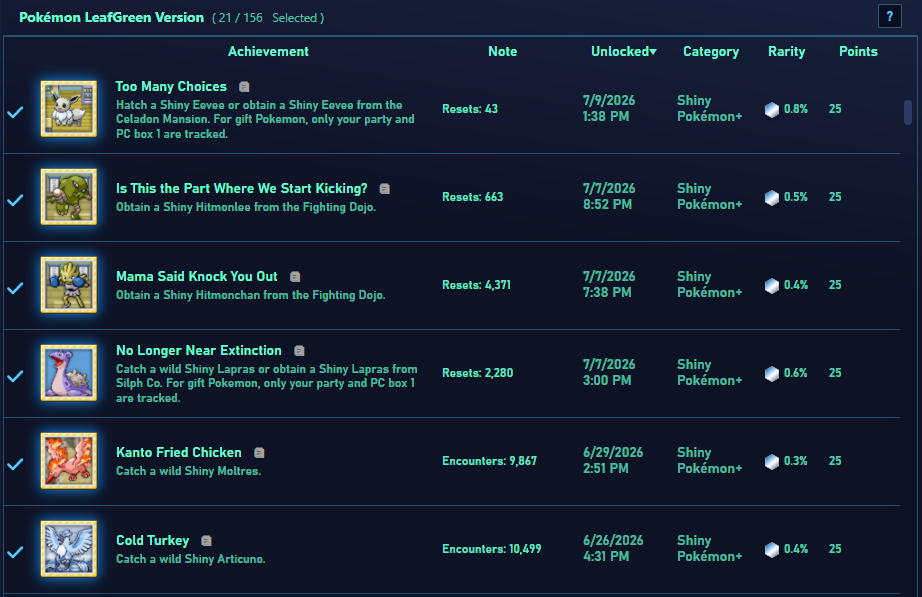

Notes can be added to each of a game’s achievements. This could be used to link to an achievement guide, mark if an achievement is bugged, or keep track of progress.

## Order

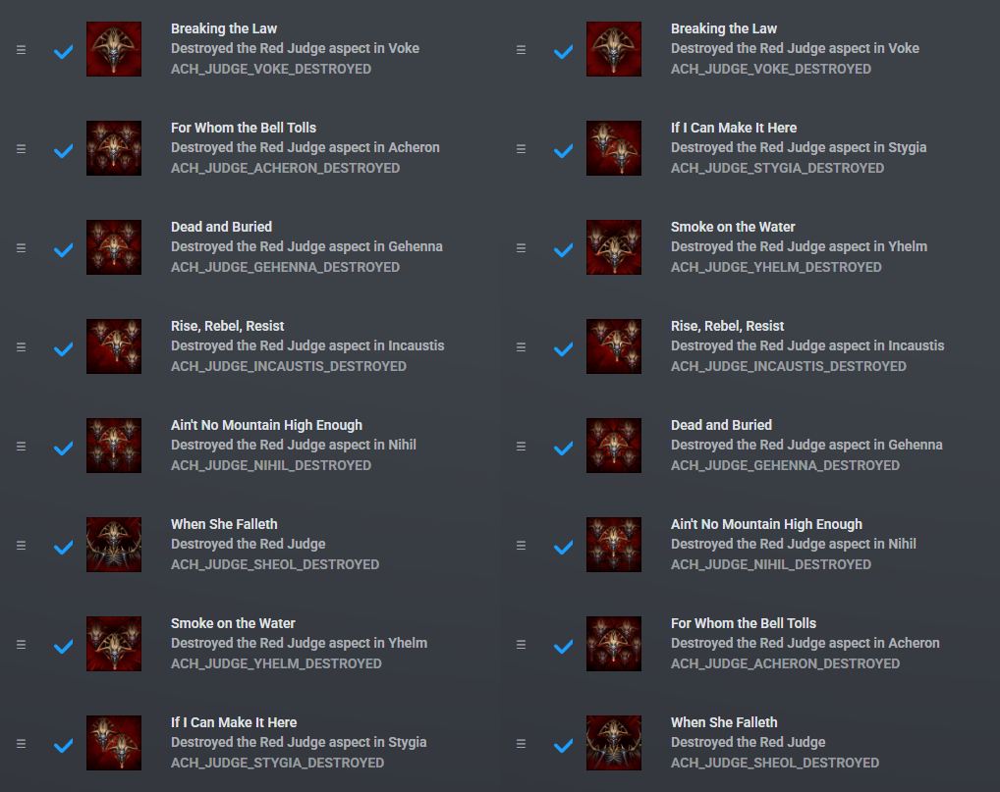

Achievements can be freely reordered per game. This is useful for platforms which initially sort achievements alphabetically, and not in the order a player may achieve them.

For example, when Metal Hellsinger achievements are reordered, there is a very satisfying progression (seen in icons).

## Icons

Locked and unlocked achievement icons can be individually customized, from web links or local files. By default, some platforms use very low-resolution images, and some are more high resolution. For comparison, here is an achievement from Flower, with Steam and PlayStation icons.

<em>Left: Steam 64x64 .jpg &nbsp;|&nbsp; Right: PlayStation 240x240 .png</em>

## Overrides

If a game is not behaving automatically, forced overrides can resolve these issues. Overrides force a game to use data from a specific platform. Games can also be excluded from refreshes in this way.

Each of these tabs has its own wiki page: [Overview](https://github.com/justin-delano/PlayniteAchievements/wiki/Overview), [Capstones](https://github.com/justin-delano/PlayniteAchievements/wiki/Capstones), [Categories](https://github.com/justin-delano/PlayniteAchievements/wiki/Categories), [Filters](https://github.com/justin-delano/PlayniteAchievements/wiki/Filters), [Notes](https://github.com/justin-delano/PlayniteAchievements/wiki/Notes), [Order](https://github.com/justin-delano/PlayniteAchievements/wiki/Achievement-Order), [Icons](https://github.com/justin-delano/PlayniteAchievements/wiki/Icons), and [Overrides](https://github.com/justin-delano/PlayniteAchievements/wiki/Overrides).

# Overlay

PlayniteAchievements includes a robust achievement notification and tracking system. When achievements are unlocked while you are in a game, notifications appear, and screenshots or videos can be taken to record your progress.

Screenshots can be taken with/without the achievement notification on screen, or they can be taken with a full presentation frame.

Unlock videos show the moment you earned an achievement, with a configurable amount of buffer time around the moment.

**Clean**

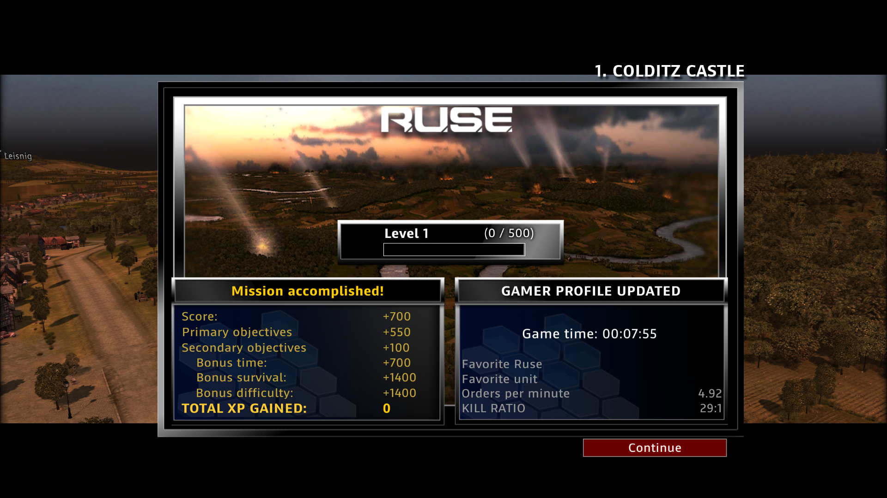

**Notification**

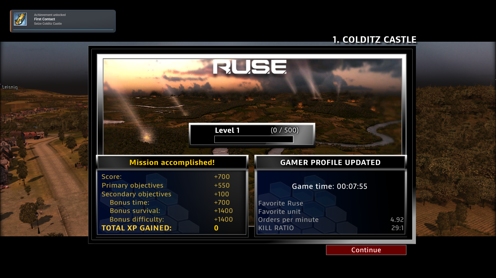

**Framed**

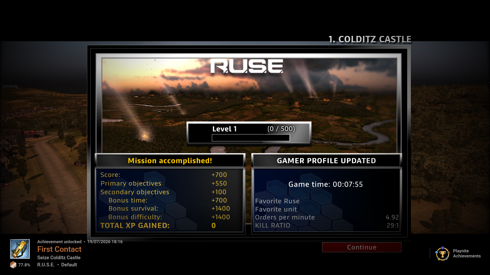

NOTE: Achievement notifications will not show for games that use DirectX 9 and lower in Exclusive Fullscreen mode.

Themes can create custom notification and frame styles, for full consistency. For example, in [Aniki-ReMake](https://github.com/Mike-Aniki/Aniki-ReMake):

**Toast**

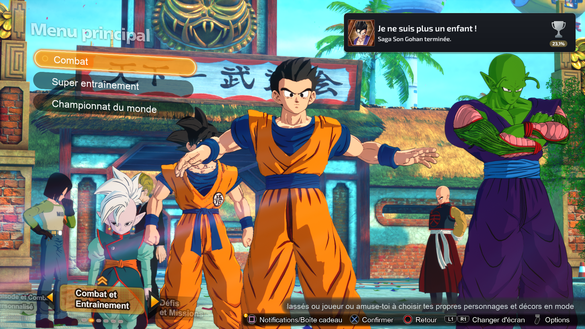

**Frame**

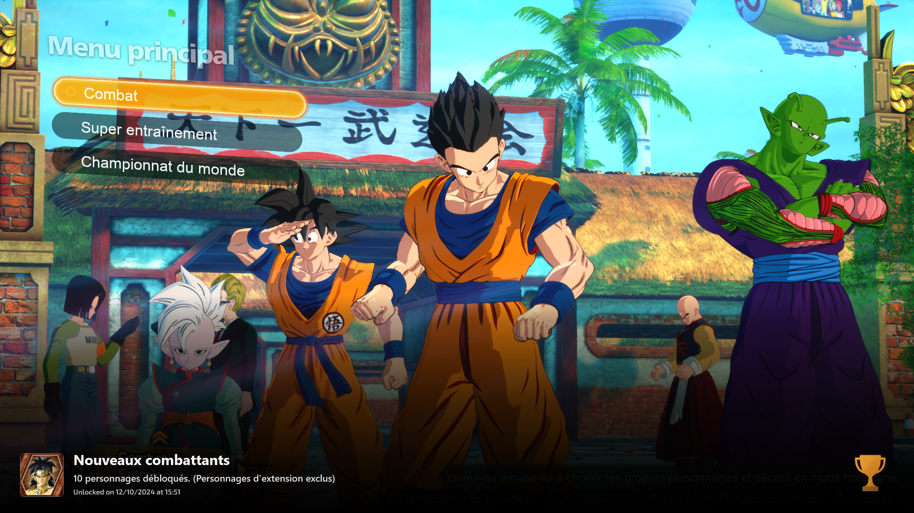

Notification and capture settings are described on the [General](https://github.com/justin-delano/PlayniteAchievements/wiki/General) settings page. Theme authors can build custom styles with [Toast and Frame Overrides](https://github.com/justin-delano/PlayniteAchievements/wiki/Toast-And-Frame-Overrides).

# Integration with Themes

Any desktop theme created with SuccessStory support can migrate the theme to use PlayniteAchievements instead.

Many fullscreen themes can be migrated as well, but these complex themes are more likely to reveal compatibility issues. I recommend using [Aniki-ReMake](https://github.com/Mike-Aniki/Aniki-ReMake) for the most comprehensive integration of PlayniteAchievements features.

See [Theme Migration](https://github.com/justin-delano/PlayniteAchievements/wiki/Theme-Migration), [Theme Bindings](https://github.com/justin-delano/PlayniteAchievements/wiki/Theme-Bindings), and [Migrating From Legacy](https://github.com/justin-delano/PlayniteAchievements/wiki/Migrating-From-Legacy) on the wiki for more detail.

# Integration with other Plugins

PlayniteAchievements supports additional features when used with the following extensions:

## Unlock sounds

Unlock sounds are built in: each notification plays a sound for its rarity tier (or for hidden and capstone unlocks), with a volume slider and a per-tier file picker under Settings > Notifications. Themes can ship their own sounds by dropping `common`/`uncommon`/`rare`/`ultrarare`/`hidden`/`capstone` files into `PlayniteAchievements/Sounds/` in the theme folder; the UniPlaySong-era `audio/Achievements/` layout is still read. UniPlaySong is no longer involved: this plugin no longer sends it the unlock signal, so its achievement sounds stay silent even if it is still installed, and the first launch copies its volume and custom files into these settings.

## StartPage

PlayniteAchievements tables and visualizations can be added to [StartPage](https://github.com/felixkmh/StartPage-for-Playnite), with their own separate customization, so you can create stunning dashboards like the example below:

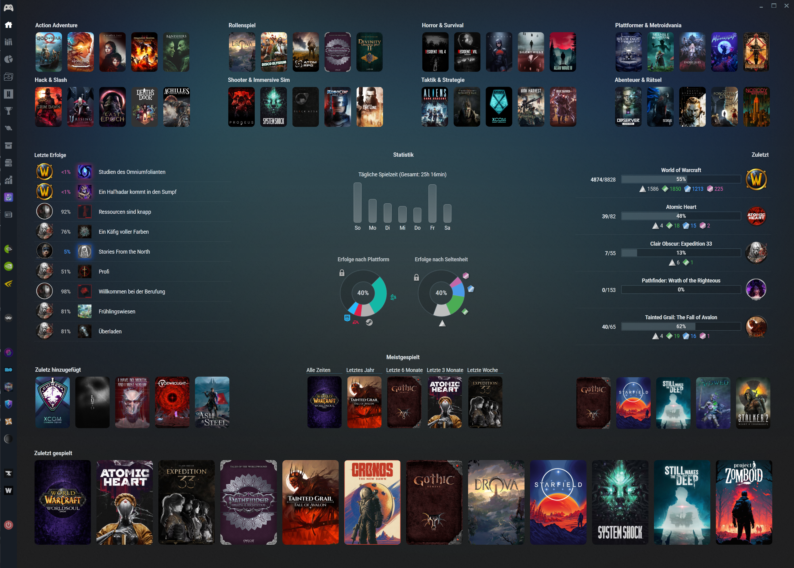

## Docs

- [Open the wiki](https://github.com/justin-delano/PlayniteAchievements/wiki)

## Examples

Coming soon!

## Acknowledgements
- @Synkro for the help creating this great updated README!
- @Ammz for the beautiful new icons and branding package, as well as new Discord feedback form.
- All other Discord testers, this would not be possible without your feedback and help!
- My Ko-Fi supporters! The coffee has kept me going throughout all this development!

## Support / Contributing / Credits

- Issues: [GitHub Issue Tracker](https://github.com/justin-delano/PlayniteAchievements/issues)
- Discussions: [GitHub Discussions](https://github.com/justin-delano/PlayniteAchievements/discussions)
- Support: [Ko-fi](https://ko-fi.com/justindelano)
- Translations: contributions are welcome through pull requests and localization updates

License: [MIT](LICENSE).
