

  <picture>
    <source
      media="(prefers-color-scheme: dark)"
      srcset="BrandingPackage/01-logo-dark-backgrounds/pa-stacked-master-crest-wordmark-spaced-gold.png"
    >
    <source
      media="(prefers-color-scheme: light)"
      srcset="BrandingPackage/02-logo-light-backgrounds/pa-stacked-master-crest-wordmark-spaced-blue.png"
    >
    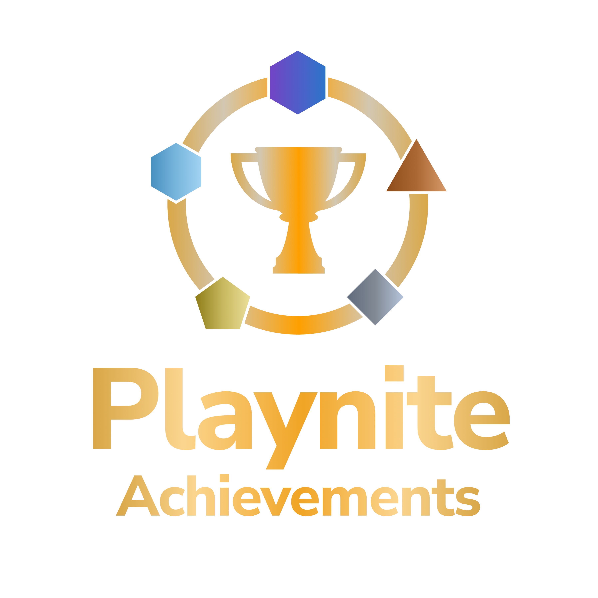
  </picture>

### Playnite Achievements is a modern, performant, and fully customizable achievement extension for Playnite. PlayniteAchievements tracks achievements from you and your friends and provides a deep set of features that allow you to tailor your achievement collection and display to your exact taste.

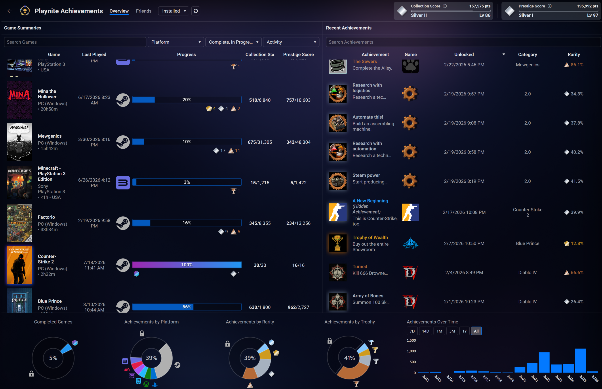

Playnite Achievements features include:

* PC storefronts, RetroAchievements & emulator support
  * [Steam](https://github.com/justin-delano/PlayniteAchievements/wiki/Steam), [GOG](https://github.com/justin-delano/PlayniteAchievements/wiki/GOG), [Epic Games Store](https://github.com/justin-delano/PlayniteAchievements/wiki/Epic), [Battle.net](https://github.com/justin-delano/PlayniteAchievements/wiki/BattleNet), [EA app](https://github.com/justin-delano/PlayniteAchievements/wiki/EA), [Ubisoft Connect](https://github.com/justin-delano/PlayniteAchievements/wiki/Ubisoft), [Game Jolt](https://github.com/justin-delano/PlayniteAchievements/wiki/GameJolt), [Riot Games](https://github.com/justin-delano/PlayniteAchievements/wiki/Riot)
  * [PlayStation Network](https://github.com/justin-delano/PlayniteAchievements/wiki/PSN), [Xbox Live](https://github.com/justin-delano/PlayniteAchievements/wiki/Xbox), [Meta Quest](https://github.com/justin-delano/PlayniteAchievements/wiki/Meta)
  * [RetroAchievements](https://github.com/justin-delano/PlayniteAchievements/wiki/RetroAchievements), [RPCS3](https://github.com/justin-delano/PlayniteAchievements/wiki/RPCS3), [ShadPS4](https://github.com/justin-delano/PlayniteAchievements/wiki/ShadPS4), [Xenia](https://github.com/justin-delano/PlayniteAchievements/wiki/Xenia)
  * [Final Fantasy XIV](https://github.com/justin-delano/PlayniteAchievements/wiki/Ffxiv), [Guild Wars 2](https://github.com/justin-delano/PlayniteAchievements/wiki/Guild-Wars-2), [Hypixel](https://github.com/justin-delano/PlayniteAchievements/wiki/Hypixel)
  * [HoYoverse](https://github.com/justin-delano/PlayniteAchievements/wiki/Hoyoverse)
  * [Exophase](https://github.com/justin-delano/PlayniteAchievements/wiki/Exophase)
* [Workshop](https://github.com/justin-delano/PlayniteAchievements/wiki/Workshop) for sharing colors, notifications, sounds, Showcase pages and game data
* [Showcase dashboards](https://github.com/justin-delano/PlayniteAchievements/wiki/Showcase-And-Pin-Collections)
* [Achievement editor](https://github.com/justin-delano/PlayniteAchievements/wiki/Editor) with spreadsheet import and export
* [Custom achievements](https://github.com/justin-delano/PlayniteAchievements/wiki/Editor#custom-achievements)
* [Manual achievement support](https://github.com/justin-delano/PlayniteAchievements/wiki/Manual-Tracking)
* [Friends achievement data](https://github.com/justin-delano/PlayniteAchievements/wiki/Friends-Overview)
* [Automatic syncing](https://github.com/justin-delano/PlayniteAchievements/wiki/Refreshing)
* [Achievement unlock notifications](https://github.com/justin-delano/PlayniteAchievements/wiki/Notifications) (with screenshots/recordings)
* [Achievement groups](https://github.com/justin-delano/PlayniteAchievements/wiki/Categories)
* [Custom achievement icons](https://github.com/justin-delano/PlayniteAchievements/wiki/Editor#icons) (animated GIF and WebM included)
* [Theme Migration](https://github.com/justin-delano/PlayniteAchievements/wiki/Theme-Migration)
* [Hotkeys](https://github.com/justin-delano/PlayniteAchievements/wiki/Menus-And-Hotkeys)
* [Tags](https://github.com/justin-delano/PlayniteAchievements/wiki/Tag-Sync)
* [Easy maintenance](https://github.com/justin-delano/PlayniteAchievements/wiki/General)

# Installation

Playnite Achievements is available in Playnite's add-on browser. Press F9 in Playnite, go to Browse > Generic Extensions, and search for "Playnite Achievements".

Alternatively, download the latest `.pext` from the [Releases page](https://github.com/justin-delano/PlayniteAchievements/releases/latest) and drag it onto the Playnite window to install it.

# First Time Setup

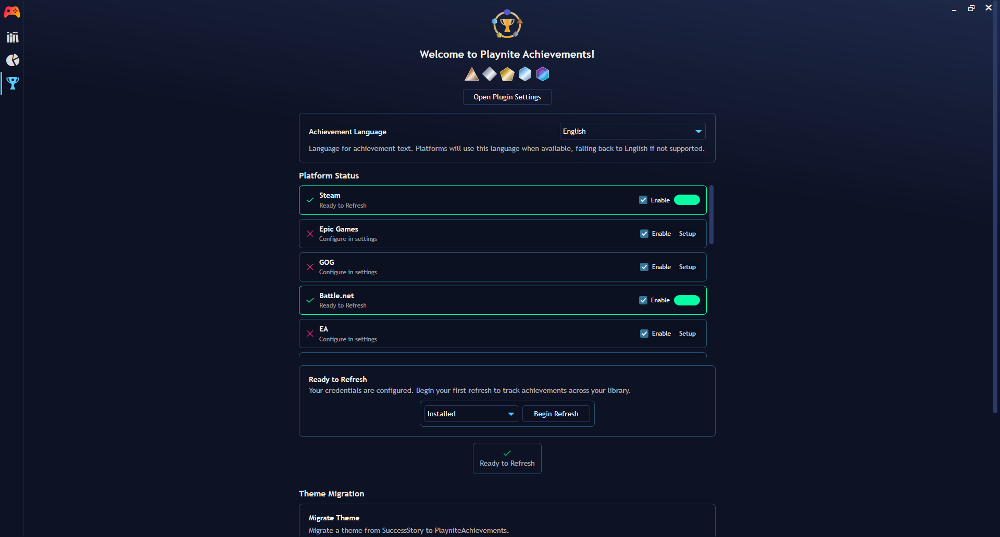

When you first start Playnite Achievements, you will be greeted by the landing page, with a list of achievement sources you can enable, and authenticate via the extension’s settings:

To authenticate with the various platforms PlayniteAchievements supports, navigate to the extension’s settings (or click the button on the landing page), and log into platforms using the Platforms tab.

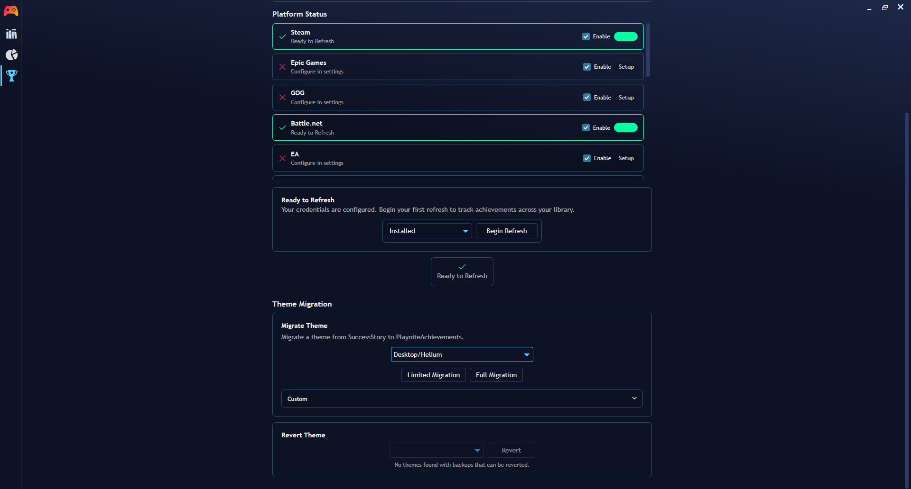

If your favorite Desktop theme was built to support SuccessStory, there is a useful [Theme Migration](https://github.com/justin-delano/PlayniteAchievements/wiki/Theme-Migration) function, which allows said theme to use PlayniteAchievements data instead. A limited migration will maintain full compatibility, while a full migration will enable new PlayniteAchievements specific features on all theme elements, such as new tooltip and click interactions for lists. A backup is made before all theme edits, and any theme migration can be reverted via a button in settings.

When you trigger a refresh, PlayniteAchievements will fetch metadata from your selected sources.

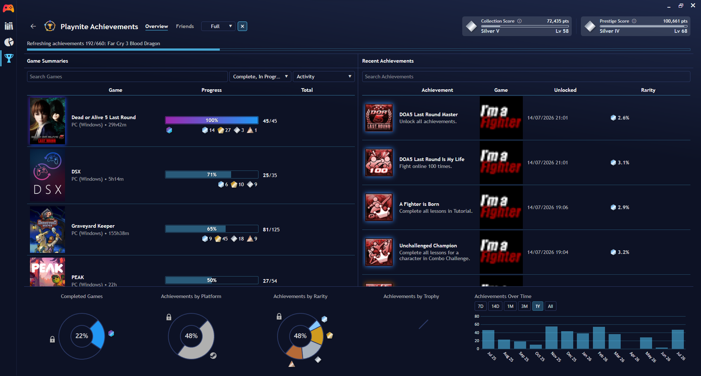

Refresh progress is shown at the top of the overview window. There are various types of refreshes, which can fetch data from installed games or recent games, or you can perform a Full refresh to fetch achievement data for all of your games.

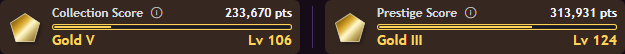

At the top right corner of the overview are your Score Cards. Your Collection Score increases as you collect achievements, with slight boosts for collecting rare achievements. Your Prestige Score increases as you unlock rare achievements, and common achievements are worth far less. Click either Score Card to learn more.

Platforms with their own point systems get score cards too: Gamerscore, Epic XP and RetroAchievements points each have their own levels. Right-click a score card to pick which two the header shows, and which side each card's badge sits on.

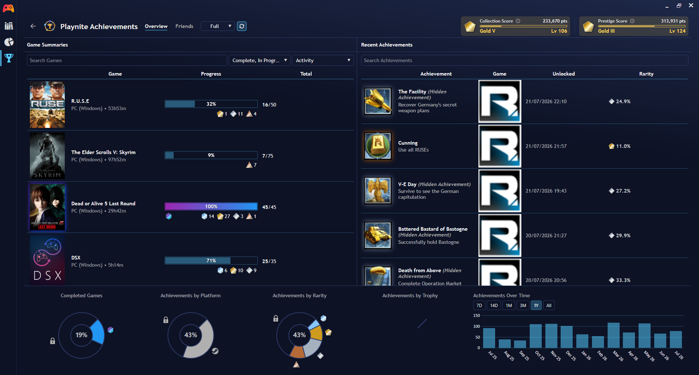

Congratulations! PlayniteAchievements is now fully functional. This concludes the first time setup guide, please see the other sections for a more detailed showcase of more advanced and enthusiast features.

See the [First Setup](https://github.com/justin-delano/PlayniteAchievements/wiki/First-Setup) guide and the [Settings](https://github.com/justin-delano/PlayniteAchievements/wiki/Settings) pages on the wiki for more detail.

# Friends

In addition to your own data, you can also retrieve achievement data for your friends. Steam, RetroAchievements, and Exophase are currently supported. First, navigate to the Friends tab in settings to get started:

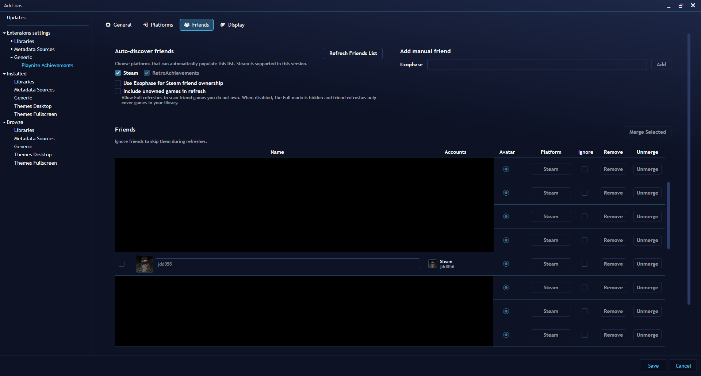

Friends data can be viewed and refreshed by selecting the Friends tab in the Overview window.

Note, with many friends and many games, these refreshes can take a significant amount of time! Shared/Recent refreshes will be the easiest to start with.

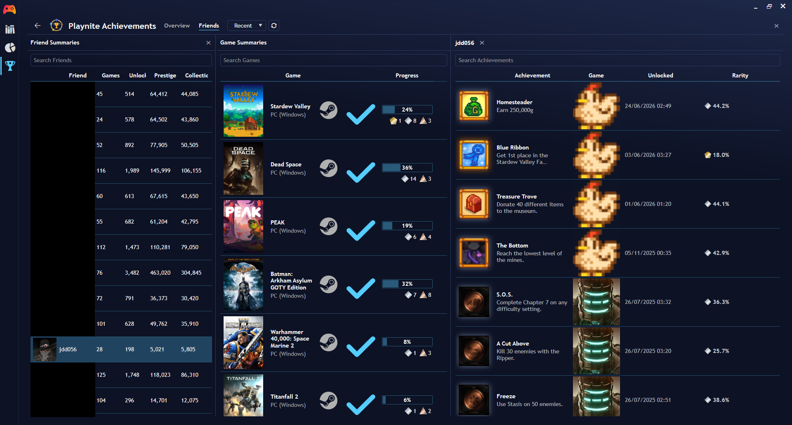

Favorite friends can be marked to narrow the list, and the Compare dropdown in any achievement grid compares your progress against a friend's, game by game.

See the [Friends Overview](https://github.com/justin-delano/PlayniteAchievements/wiki/Friends-Overview) guide and the [Friends](https://github.com/justin-delano/PlayniteAchievements/wiki/Friends) settings page on the wiki for more detail.

# Customization

PlayniteAchievements features comprehensive customization options.

  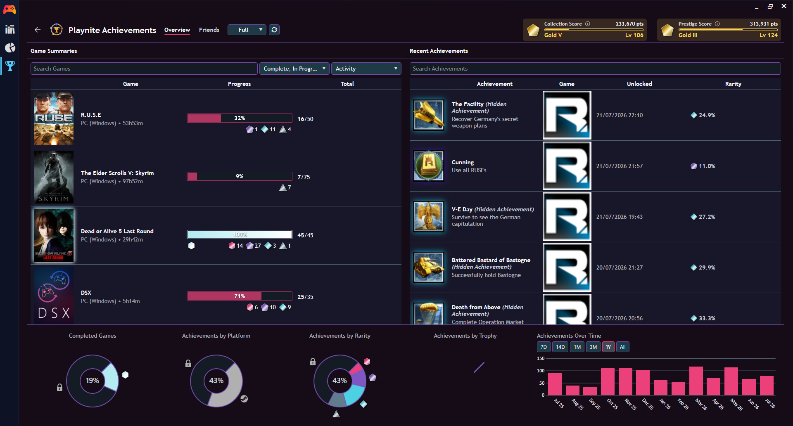
  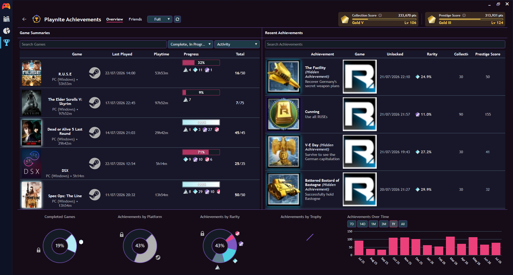

* Grid layout customizations
  * Column widths, column orders, column cell alignments
  * Separate per grid, for full flexibility
* Color and font customizations
  * All UI colors and fonts can be freely edited
  * 20 Presets for easy experimentation
  * Save, export and import your own color sets, or install them from the Workshop
  * Options to automatically follow Playnite theme colors.
* Rarity and completion accents
  * Add a glowing halo, a rotating sunburst, or both to the rarities of your choice, or to completed games.
  * Color text by achievement rarity
  * Show a special progress bar for completed games
  * Frame the covers of completed games with laurels
* Flexible Overview visualizations
  * Pie charts for visualizing achievements per platform, rarity, or completion, as a full pie or a ring, with a legend on either side.
  * Bar chart for showing achievement progress over time, optionally split by platform.
  * A Mini Showcase below the grids, whose charts follow your filters and can filter the grids in turn.
* Filter the Achievements grid by unlock date, rarity and trophy
* Leave games hidden in Playnite out of your totals

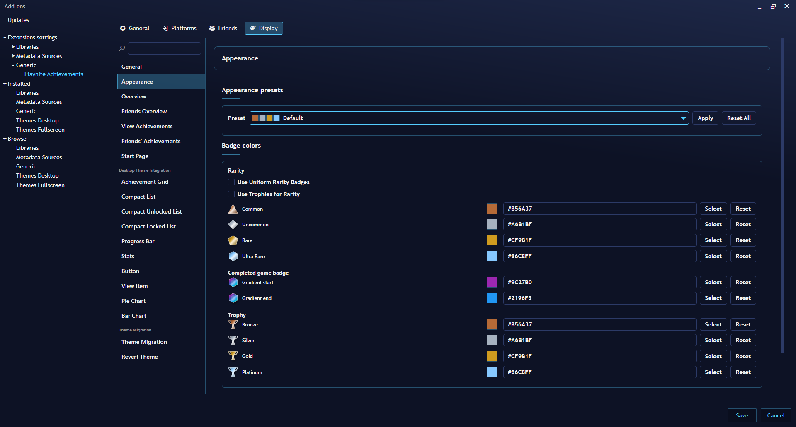

Every appearance option is described on the [Display](https://github.com/justin-delano/PlayniteAchievements/wiki/Display) settings page and the [Overview Window](https://github.com/justin-delano/PlayniteAchievements/wiki/Overview-Window) guide on the wiki.

# Showcase

Showcase is the third tab of the Overview window, providing customizable dashboards for your achievement collection. Each Showcase page is a 3×3 grid of widgets, including your profile and score cards, pie charts, a timeline, an activity calendar, overall statistics, pinned achievements, favorite games, icon mosaics, and a slideshow of your unlock screenshots.

Edit layout allows widgets to be moved, blocks to be split or merged in any direction, and new pages to be created from blank, analytics, or collection templates. Any number of pages can be created, and controller bumpers move between them.

Any achievement or game can be pinned to Showcase from its right-click menu, into any number of named collections, and each widget can display a different collection.

Every Showcase widget can also be placed on [StartPage](https://github.com/felixkmh/StartPage-for-Playnite) with its own settings, and Showcase pages can be shared through the Workshop.

See the [Showcase and Pin Collections](https://github.com/justin-delano/PlayniteAchievements/wiki/Showcase-And-Pin-Collections) guide for the full workflow.

# Workshop

The Workshop is a community repository for PlayniteAchievements customizations: color sets, notification and frame styles, sound packs, Showcase pages, and per-game achievement data. Open it from Settings > Workshop to browse items shared by other users, preview them, and install them. No account is required.

Every surface with an Export button also has a Share to Workshop entry. Bundles share several parts together, with a choice of which saved preset the colors, sounds, notification, and frame each come from.

Installed items are kept in your Library, which shows where each item is in use. Workshop items are checked for updates every hour, and updates keep any changes you have made.

Game data allows per-game work to be shared: if another user has already reordered, categorized, or re-iconed a game's achievements, their data can be applied to your copy of the game. Right-click a game and choose Workshop to see what has been shared for it.

See the [Workshop](https://github.com/justin-delano/PlayniteAchievements/wiki/Workshop) guide for more detail.

# Per-Game Customization

The [Manage Achievements](https://github.com/justin-delano/PlayniteAchievements/wiki/Manage-Achievements) menu opens up another extremely powerful form of customization, with options available for each individual game in your library. The window has four tabs: Overview, Editor, Categories, and Notifications.

## Overview

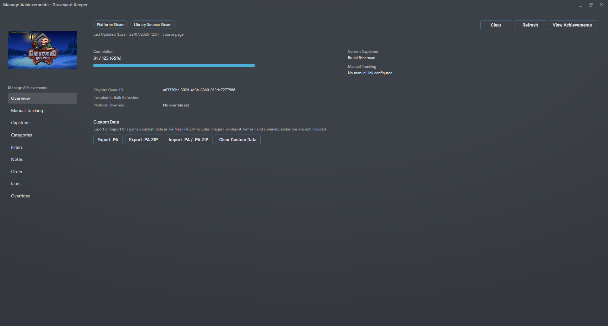

The overview tab shows the general achievement status for the game. If a game is not behaving automatically, forced overrides make it use data from a specific platform, and games can be excluded from refreshes here too. All of a game's customized data can be exported to share with other users, imported from theirs, or installed from the Workshop.

See [Overview](https://github.com/justin-delano/PlayniteAchievements/wiki/Overview) on the wiki for more detail.

## Editor

The Editor contains every achievement of a game in one place. Achievements can be renamed, re-iconed, reordered, categorized, filtered, annotated, set as goals, or marked as capstones, individually or in bulk, with full undo and redo.

* Filtered achievements are hidden from your views. This is particularly useful for games with unobtainable or multiplayer-specific achievements. For example, achievements could be filtered out of Tomb Raider’s list for these reasons.
* Notes can link to an achievement guide, mark an achievement as bugged, or keep track of progress.
* Order fixes platforms which sort achievements alphabetically, and not in the order a player may achieve them. When Metal Hellsinger achievements are reordered, there is a very satisfying progression (seen in icons).
* Goals pin the achievements you are chasing to the top of your lists (themes included), and retire themselves once unlocked.
* Types mark achievements as Singleplayer, Stackable, Missable, Unobtainable, Progression, Win Condition, Post Game, Completion, Cumulative, Challenge, or Side Quest. Many are filled in automatically for Steam, RetroAchievements, Riot, World of Warcraft and Guild Wars 2.

Achievements can also be exported to a CSV spreadsheet, edited (icons included), and imported back.

### Capstones

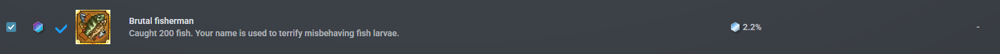

Some platforms automatically unlock an achievement to mark game completion, for example with PlayStation and Platinum trophies. To generalize this, PlayniteAchievements developed a Capstone system, which can be used by games on all platforms. Unlocking an achievement that has been marked as a capstone will mark the game as completed. This is particularly useful when DLC/Multiplayer trophies should not count towards game completion.

Each category can have its own capstone, allowing the base game and each DLC to be completed separately. Auto Capstone sets a game's capstone to its platinum in one click, or creates one if the game has none, and can be applied to every game automatically as it refreshes.

### Icons

Locked and unlocked achievement icons can be individually customized, from web links or local files. By default, some platforms use very low-resolution images, and some are more high resolution. For comparison, here is an achievement from Flower, with Steam and PlayStation icons.

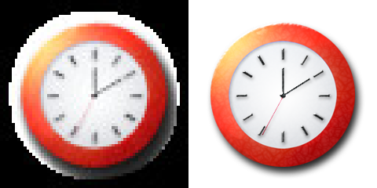

<em>Left: Steam 64x64 .jpg &nbsp;|&nbsp; Right: PlayStation 240x240 .png</em>

Animated GIF and WebM icons are supported too, transparency included.

### Custom achievements

Achievements can be authored for any game, including games without a supported platform. In the Editor, custom achievements can be created from scratch or duplicated from existing ones, and a game can be given its own custom platform with a name, color, and icon. Custom achievements behave like any other achievement, with categories, capstones, notifications, and score contributions, and can be shared as a file or through the Workshop.

See [Editor](https://github.com/justin-delano/PlayniteAchievements/wiki/Editor) and [Capstones](https://github.com/justin-delano/PlayniteAchievements/wiki/Capstones) on the wiki for more detail.

## Categories

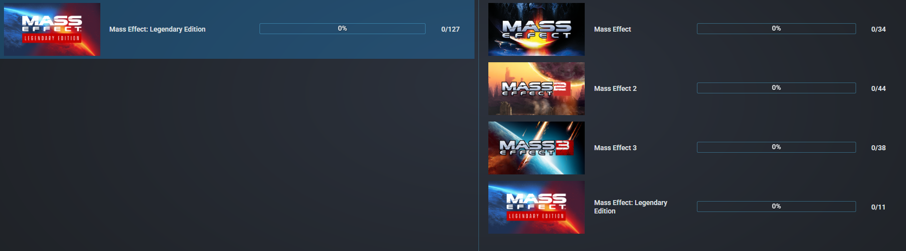

Achievements can be manually (or, in some cases, automatically) organized into categories. Each category can have a set of Types (Singleplayer, Stackable, Missable) as well as a Label ("DLC #1"). Categories are especially helpful for multi-game collections or games with many DLC packs.

Categories can contain other categories, and platforms that group their achievements (Steam DLC, PlayStation collections, World of Warcraft, StarCraft II, Final Fantasy XIV, and more) show their real structure automatically. Every achievement grid has a Category Mode that groups achievements by category, and a whole category can be excluded from your stats in one click.

See [Categories](https://github.com/justin-delano/PlayniteAchievements/wiki/Categories) on the wiki for more detail.

## Notifications

The Notifications tab gives a game its own notification style and unlock sounds, separate from those of its platform. It uses the same editor as the Notifications settings page, described under [Overlay](#overlay).

# Overlay

PlayniteAchievements includes a robust achievement notification and tracking system. When achievements are unlocked while you are in a game, notifications appear, and screenshots or videos can be taken to record your progress.

Steam, RetroAchievements and Guild Wars 2 detect unlocks as they happen, and progress notifications appear as you approach an achievement. Notifications can be styled separately for each rarity tier, platform, or game, and controllers (Xbox, DualSense, DualShock 4, and Steam Controller) can vibrate on each unlock.

Notifications can slide, slide in from the side, fade, or zoom, at your choice of speed and with a smooth or bouncy feel. They can sit in any corner or at the bottom center of the screen, and each notification style can carry its own position.

Screenshots can be taken with/without the achievement notification on screen, or they can be taken with a full presentation frame.

Unlock videos show the moment you earned an achievement, with a configurable amount of buffer time around the moment. All screenshots and clips are available in the Captures viewer, accessible from any achievement grid.

**Clean**

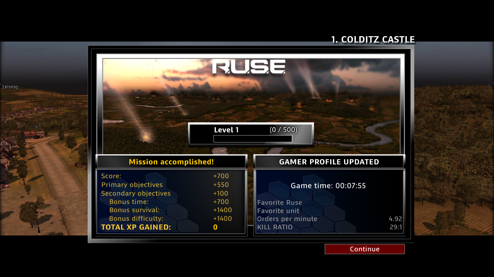

**Notification**

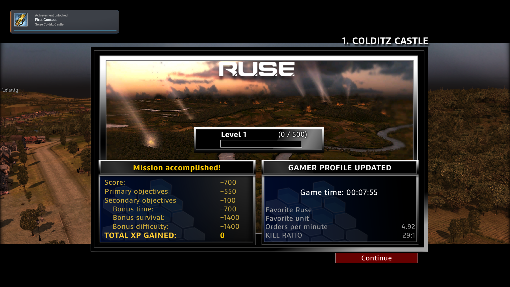

**Framed**

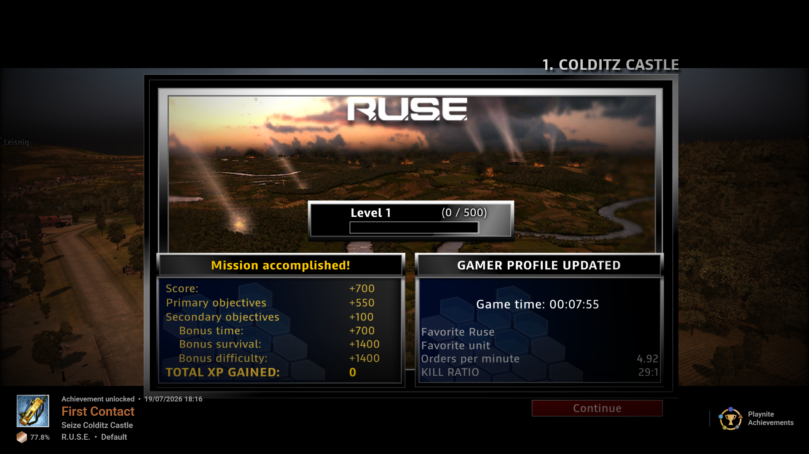

NOTE: Achievement notifications will not show for games that use DirectX 9 and lower in Exclusive Fullscreen mode.

Themes can create custom notification and frame styles, for full consistency. For example, in [Aniki-ReMake](https://github.com/Mike-Aniki/Aniki-ReMake):

**Toast**

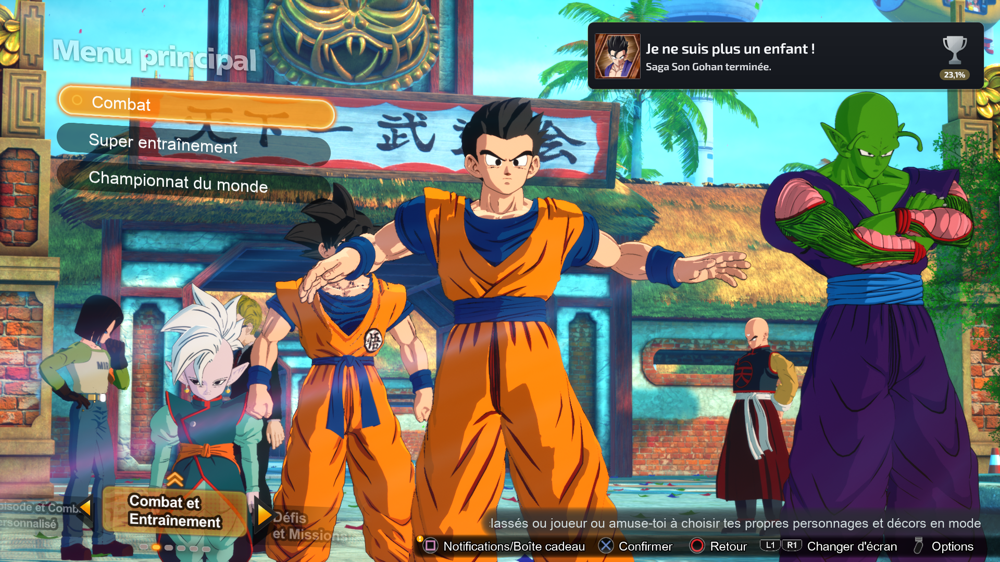

**Frame**

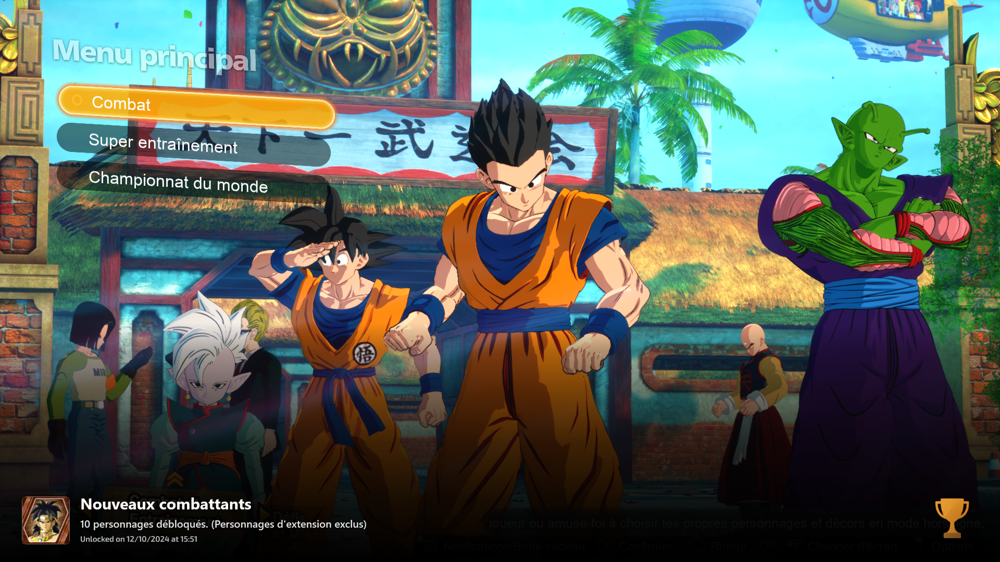

## Unlock sounds

Unlock sounds are built in: each notification plays a sound for its rarity tier, or for hidden and capstone unlocks. Pick your own sound files, use different sounds for each platform or game, save your favorites as sound packs, or install one from the Workshop. Themes can ship their own sounds too.

Notification, sound and capture settings are described on the [Notifications](https://github.com/justin-delano/PlayniteAchievements/wiki/Notifications) settings page and the [Captures](https://github.com/justin-delano/PlayniteAchievements/wiki/Captures) guide. Theme authors can build custom styles with [Notification Overrides](https://github.com/justin-delano/PlayniteAchievements/wiki/Notification-Overrides).

# Integration with Themes

Any desktop theme created with SuccessStory support can migrate the theme to use PlayniteAchievements instead.

Many fullscreen themes can be migrated as well, but these complex themes are more likely to reveal compatibility issues. I recommend using [Aniki-ReMake](https://github.com/Mike-Aniki/Aniki-ReMake) for the most comprehensive integration of PlayniteAchievements features.

See [Theme Migration](https://github.com/justin-delano/PlayniteAchievements/wiki/Theme-Migration), [Theme Bindings](https://github.com/justin-delano/PlayniteAchievements/wiki/Theme-Bindings), and [Migrating From Legacy](https://github.com/justin-delano/PlayniteAchievements/wiki/Migrating-From-Legacy) on the wiki for more detail.

# Integration with other Plugins

PlayniteAchievements supports additional features when used with the following extensions:

## StartPage

PlayniteAchievements tables and visualizations can be added to [StartPage](https://github.com/felixkmh/StartPage-for-Playnite), with their own separate customization, so you can create stunning dashboards like the example below:

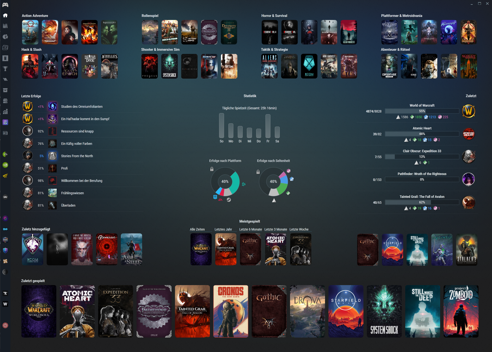

## Docs

- [Open the wiki](https://github.com/justin-delano/PlayniteAchievements/wiki)

## Examples

Coming soon!

## Acknowledgements
- @Synkro for the help creating this great updated README!
- @Ammz for the beautiful new icons and branding package, as well as new Discord feedback form.
- All other Discord testers, this would not be possible without your feedback and help!
- My Ko-Fi supporters! The coffee has kept me going throughout all this development!

## Support / Contributing / Credits

- Issues: [GitHub Issue Tracker](https://github.com/justin-delano/PlayniteAchievements/issues)
- Discussions: [GitHub Discussions](https://github.com/justin-delano/PlayniteAchievements/discussions)
- Support: [Ko-fi](https://ko-fi.com/justindelano)
- Translations: contributions are welcome through pull requests and localization updates

License: [MIT](LICENSE).
